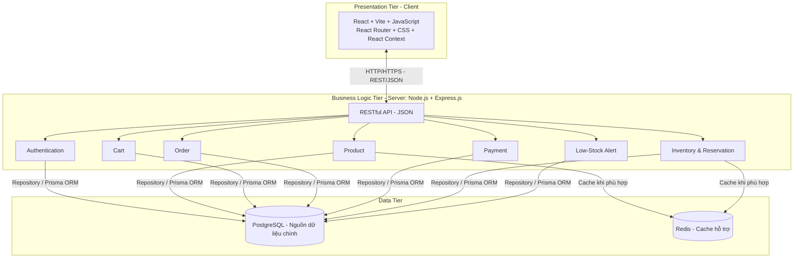

# ĐẶC TẢ KIẾN TRÚC HỆ THỐNG

**Tên đề tài:** Multi-Warehouse E-Commerce & Inventory Control System  
**Tên tài liệu:** System Architecture Specification  
**Phiên bản:** 1.0  
**Trạng thái:** Tiêu chuẩn kiến trúc chính thức của nhóm  
**Phạm vi áp dụng:** Thiết kế, lập trình, tích hợp, kiểm thử và báo cáo đồ án

---

## 1. Mục đích và phạm vi

Tài liệu quy định kiến trúc, công nghệ, trách nhiệm của các thành phần và nguyên tắc triển khai thống nhất cho hệ thống thương mại điện tử tích hợp quản lý tồn kho đa kho. Tất cả thành viên sử dụng tài liệu này làm căn cứ khi xây dựng chức năng và tích hợp mã nguồn.

Hệ thống áp dụng đồng thời bốn quyết định kiến trúc ở các cấp độ khác nhau:

| Cấp độ | Kiến trúc chính thức | Mục đích |
|---|---|---|
| Tổng thể | **Client–Server Architecture** | Phân tách ứng dụng phía trình duyệt và máy chủ |
| Phân tầng | **3-Tier Architecture** | Phân tách giao diện, xử lý nghiệp vụ và dữ liệu |
| Tổ chức backend | **Modular Monolith Architecture** | Chia chức năng theo module trong một ứng dụng backend |
| Tổ chức mã nguồn backend | **Layered Architecture: Controller–Service–Repository** | Tách tiếp nhận yêu cầu, nghiệp vụ và truy xuất dữ liệu |

Bốn quyết định này bổ trợ cho nhau, không phải bốn hệ thống riêng biệt. **MVC truyền thống không được chọn làm tên kiến trúc tổng thể**; React đảm nhiệm giao diện riêng biệt, còn backend cung cấp API.

## 2. Sơ đồ kiến trúc tổng thể



**Luồng xử lý chuẩn:** Client → HTTP Request → Route/Middleware → Controller → Service → Repository → PostgreSQL → HTTP Response → Client.

## 3. Kiến trúc Client–Server

### 3.1. Client

Client sử dụng **React, Vite, JavaScript, React Router, CSS và React Context**. Client chịu trách nhiệm:

- Hiển thị Product Catalog, Product Detail, Shopping Cart, Checkout và kết quả đặt hàng.
- Hiển thị Order Tracking, Purchase History, Inventory Dashboard, Warehouse Inventory, Low-Stock Alerts và Product Management.
- Tiếp nhận thao tác người dùng, quản lý trạng thái giao diện và gửi yêu cầu API.
- Hiển thị dữ liệu và lỗi do server trả về.

Client **không truy cập trực tiếp PostgreSQL/Redis**, không tự xác nhận thanh toán và không tự quyết định lượng tồn kho chính thức. Kiểm tra dữ liệu trên giao diện chỉ phục vụ trải nghiệm người dùng; server luôn kiểm tra lại.

### 3.2. Server

Server sử dụng **Node.js và Express.js**, cung cấp **RESTful API** qua HTTP/HTTPS, trao đổi dữ liệu bằng JSON. Server chịu trách nhiệm:

- Xác thực, phân quyền theo vai trò.
- Quản lý catalog, sản phẩm, đơn hàng và lịch sử giao dịch.
- Kiểm tra tồn kho, chọn warehouse đáp ứng toàn bộ đơn hàng và giữ chỗ hàng.
- Thực hiện quy trình thanh toán giả lập.
- Cập nhật trạng thái đơn hàng, tồn kho và cảnh báo tồn kho thấp.
- Đảm bảo các quy tắc nghiệp vụ và tính nhất quán dữ liệu.

## 4. Kiến trúc ba tầng (3-Tier Architecture)

### 4.1. Presentation Tier

Công nghệ: **React + Vite + JavaScript + React Router + CSS + React Context**.

Tầng này hiển thị giao diện và gọi API, không chứa quy tắc nghiệp vụ quyết định tính hợp lệ của đơn hàng hay tồn kho.

### 4.2. Business Logic Tier

Công nghệ: **Node.js + Express.js**.

Tầng này thực hiện xác thực, quản lý đơn hàng, xử lý mock payment, stock reservation, kiểm tra tồn kho, cập nhật trạng thái và phát sinh cảnh báo.

### 4.3. Data Tier

Công nghệ: **PostgreSQL + Prisma ORM + Redis**.

- **PostgreSQL** là nguồn dữ liệu chính (source of truth) cho người dùng, sản phẩm, warehouse, inventory, reservation, đơn hàng và thanh toán.
- **Prisma ORM** là công cụ truy cập PostgreSQL từ backend. Với truy vấn hoặc cơ chế khóa đặc thù, có thể sử dụng SQL trong phạm vi transaction được kiểm soát.
- **Redis** hỗ trợ caching; không thay thế PostgreSQL trong quyết định giữ hàng, trừ hàng hoặc xác nhận giao dịch.

## 5. Modular Monolith Architecture

Backend chạy dưới dạng **một ứng dụng triển khai thống nhất**, chia thành các module nghiệp vụ:

| Module | Trách nhiệm chính |
|---|---|
| Authentication | Đăng nhập, JWT, mật khẩu được băm bằng bcrypt, phân quyền |
| Product | Danh mục, chi tiết, tạo/sửa/ngừng kinh doanh sản phẩm |
| Cart | Nghiệp vụ giỏ hàng phía server khi cần; xác thực lại sản phẩm và giá khi checkout |
| Order | Tạo đơn, trạng thái, theo dõi, lịch sử và hủy đơn |
| Payment | Mock Payment Gateway và xử lý kết quả thanh toán |
| Inventory | Tồn kho theo warehouse, chọn kho, reservation, trừ/hoàn giữ hàng, nhập kho |
| Alert | Kiểm tra threshold và quản lý cảnh báo tồn kho thấp |

**Quy tắc module:**

1. Mỗi module có trách nhiệm rõ ràng; tránh lặp business logic.
2. Module phối hợp thông qua service/interface được công bố, không truy cập tùy tiện repository nội bộ của module khác.
3. Những nghiệp vụ cần cập nhật dữ liệu ở nhiều module phải được điều phối trong transaction phù hợp.
4. Không tách các module thành microservices trong phạm vi đồ án.

## 6. Layered Architecture: Controller–Service–Repository

Mỗi module backend tuân thủ cấu trúc:

```text
src/
  modules/
    inventory/
      inventory.routes.js
      inventory.controller.js
      inventory.service.js
      inventory.repository.js
    order/
      order.routes.js
      order.controller.js
      order.service.js
      order.repository.js
    ...
  middlewares/
  config/
  app.js
  server.js
prisma/
  schema.prisma
```

Cấu trúc trên là **quy ước tổ chức mã nguồn**; các module khác áp dụng cùng nguyên tắc.

- **Route/Middleware:** Định tuyến, xác thực JWT, kiểm tra quyền và xử lý lỗi chung.
- **Controller:** Nhận request, kiểm tra định dạng đầu vào, gọi service và trả HTTP response.
- **Service:** Thực thi business rules, phối hợp module và điều phối transaction.
- **Repository:** Đọc/ghi dữ liệu bằng Prisma hoặc SQL có kiểm soát.

**Không đặt business logic trong React component, Express route hoặc repository.** Không cho controller gọi trực tiếp Prisma để bỏ qua service.

## 7. Quy tắc nghiệp vụ bắt buộc

### 7.1. Single-Warehouse Fulfillment

Mỗi đơn hàng được đáp ứng bởi **một warehouse duy nhất**. Warehouse được chọn phải có đủ **Available Stock** cho **tất cả sản phẩm và số lượng** trong đơn hàng. Không chia một đơn hàng sang nhiều warehouse. Nếu không có warehouse nào đủ hàng, checkout không được hoàn tất.

### 7.2. Stock Reservation và thanh toán giả lập

Quy trình nghiệp vụ:

1. Server kiểm tra lại sản phẩm, giá, số lượng và quyền đặt hàng.
2. Server xác định một warehouse đủ toàn bộ đơn hàng.
3. Server tạo đơn ở trạng thái **PendingPayment** và giữ chỗ hàng bằng thao tác dữ liệu an toàn khi có truy cập đồng thời.
4. Hệ thống thực hiện mock payment **ngoài transaction đang khóa dữ liệu tồn kho**.
5. Khi thanh toán thành công, server xác nhận thanh toán, chuyển đơn sang **Paid**, hoàn tất reservation và ghi nhận việc trừ tồn kho theo mô hình dữ liệu thống nhất.
6. Khi thanh toán thất bại, reservation được giải phóng theo quy tắc nghiệp vụ; đơn vẫn ở **PendingPayment** để hỗ trợ thanh toán lại. Lần thử lại phải kiểm tra và giữ hàng lại nếu reservation trước đã được giải phóng.

**Không giữ transaction/khóa database trong lúc chờ mock payment.** Các bước cập nhật dữ liệu quan trọng phải có transaction ngắn, cơ chế kiểm soát đồng thời và xử lý yêu cầu lặp để tránh trừ tồn kho hai lần.

### 7.3. Quản lý số lượng tồn kho

Nhóm phải thống nhất cách biểu diễn `onHand`, `reserved` và `available` trong schema. Một quy ước nhất quán là:

`available = onHand - reserved`

Nếu dùng quy ước này, khi reserve chỉ tăng `reserved`; khi thanh toán thành công giảm cả `onHand` và `reserved` cùng lượng hàng đã giữ; khi giải phóng reservation chỉ giảm `reserved`. **Không được vừa giảm `available` thủ công vừa áp dụng công thức trên gây trừ hàng hai lần.**

### 7.4. Order Lifecycle

Luồng chính:

`PendingPayment → Paid → Processing → Completed`

Quy tắc hủy:

- `PendingPayment → Cancelled` khi thỏa điều kiện.
- `Paid` → `Cancelled`: Chỉ cho phép hủy khi đơn hàng ở trạng thái Paid. Hệ thống phải hoàn trả số lượng sản phẩm đã trừ vào tồn kho của warehouse xử lý đơn hàng. Việc cập nhật trạng thái đơn hàng và hoàn trả tồn kho phải được thực hiện nhất quán trong cùng một transaction.
- Không cho phép hủy từ `Processing` hoặc `Completed`.
- Thanh toán thất bại **không tự động chuyển đơn sang Cancelled**.

### 7.5. Low-Stock Alert

Cảnh báo được kích hoạt khi:

`Available Stock <= Low-Stock Threshold`

Ngưỡng được xác định theo sản phẩm và warehouse. Khi nhập kho hoặc thay đổi reservation/tồn kho, hệ thống cập nhật trạng thái cảnh báo phù hợp.

### 7.6. Tính nhất quán và chống overselling

- PostgreSQL là nguồn dữ liệu có thẩm quyền.
- Việc kiểm tra đủ hàng và tạo reservation phải là thao tác an toàn dưới tải đồng thời, sử dụng transaction kết hợp khóa dòng, cập nhật có điều kiện hoặc cơ chế tương đương.
- Không dùng thao tác “đọc số lượng → kiểm tra → ghi” tách rời mà không có bảo vệ đồng thời.
- Các thao tác xác nhận thanh toán, hoàn tất reservation và hủy đơn phải có cơ chế idempotency để tránh xử lý lặp.
- Redis chỉ hỗ trợ hiệu năng, không thay thế cơ chế nhất quán của PostgreSQL.

## 8. Xác thực và phân quyền

- Hệ thống sử dụng **JWT** để xác thực request và **bcrypt** để băm mật khẩu.
- Server kiểm tra quyền theo vai trò ở middleware/service đối với API được bảo vệ.
- Khách hàng có thể xem catalog trước khi đăng nhập; các hành động được bảo vệ yêu cầu xác thực.
- Không dựa vào việc ẩn nút trên giao diện để thay thế kiểm tra quyền ở server.
- Không lưu mật khẩu dạng văn bản thuần trong database.

Phân quyền theo kho phụ trách:
- Mỗi Warehouse Manager được phân công quản lý một warehouse cụ thể.
- Warehouse Manager được xem tồn kho của tất cả warehouse và tổng tồn kho toàn hệ thống.
- Warehouse Manager chỉ được cập nhật tồn kho, nhập bổ sung hàng và thiết lập ngưỡng cảnh báo tại warehouse được phân công.
- Warehouse Manager chỉ được xem cảnh báo tồn kho thấp của warehouse mình phụ trách.
- Backend phải kiểm tra mã warehouse được phân công của tài khoản trước khi cho phép thực hiện các thao tác quản lý kho.

## 9. Tiêu chuẩn API và tích hợp

- Sử dụng RESTful API, JSON, HTTP status code phù hợp.
- API có định dạng request/response và lỗi thống nhất.
- Mỗi endpoint xác định rõ phương thức HTTP, đường dẫn, quyền truy cập, dữ liệu đầu vào, dữ liệu trả về và trường hợp lỗi.
- Frontend không phụ thuộc trực tiếp vào cấu trúc bảng database.
- Thay đổi API contract phải được trao đổi giữa các thành viên liên quan trước khi tích hợp.
- Kiểm tra tính hợp lệ của dữ liệu luôn thực hiện ở backend, kể cả khi frontend đã kiểm tra.

## 10. Bộ công nghệ chính thức (Technology Stack)

| Thành phần | Công nghệ sử dụng |
|---|---|
| Frontend | React + Vite + JavaScript |
| Routing | React Router |
| Styling | CSS |
| State management frontend | React Context |
| Backend runtime | Node.js |
| Backend framework | Express.js |
| API | RESTful API / JSON |
| Database | PostgreSQL |
| ORM | Prisma |
| Cache | Redis |
| Authentication | JWT + bcrypt |
| Payment | Mock Payment Gateway do nhóm xây dựng |
| Unit testing | Vitest |
| API / Integration testing | Supertest |
| Load testing | k6 |
| API inspection/testing | Postman |
| Version control | Git + GitHub |

Đây là **bộ công nghệ được lựa chọn cho toàn bộ quá trình triển khai**, không phải danh sách các công nghệ đã hoàn thành cài đặt ở thời điểm ban hành tài liệu.

## 11. Phân công trách nhiệm

| Thành viên | Phạm vi |
|---|---|
| **M1 – Vũ Minh Sơn (52400089)** | Storefront, Shopping Cart, Checkout UI, Inventory Dashboard và tích hợp API frontend |
| **M2 – Trần Hồ Duy Ân (52400065)** | Order Execution, Mock Payment, Stock Reservation |
| **M3 – Nguyễn Anh Quân (52400310)** | Database Schema, PostgreSQL Transactions, Redis |
| **M4 – Phạm Đức Thiện (52400318)** | Unit Testing, Integration Testing, Load Testing |

Việc phân công không loại trừ phối hợp liên thành viên khi một chức năng đi qua nhiều tầng.

## 12. Kiểm thử và tiêu chí tuân thủ kiến trúc

- **Unit tests (Vitest):** Kiểm thử business rules của service, bao gồm chọn kho, tính tồn kho khả dụng, trạng thái đơn và cảnh báo.
- **API/Integration tests (Supertest):** Kiểm thử endpoint, xác thực/phân quyền, tích hợp service và repository.
- **Load tests (k6):** Kiểm tra tải và các trường hợp checkout đồng thời để phát hiện overselling hoặc cập nhật tồn kho sai.
- **Postman:** Kiểm tra thủ công API và chia sẻ các tình huống gọi API trong nhóm.

Các tình huống bắt buộc phải kiểm tra gồm: một kho đủ toàn bộ đơn; không kho nào đủ; hai khách cùng mua số hàng giới hạn; thanh toán thành công/thất bại; retry thanh toán; request thanh toán lặp; hủy đơn hợp lệ/không hợp lệ; cảnh báo khi tồn kho chạm ngưỡng.

## 13. Quy trình Git và tích hợp

- `main`: Nhánh ổn định phục vụ phiên bản phát hành/nộp bài.
- `develop`: Nhánh tích hợp các chức năng đã được kiểm tra.
- `feature/...`: Nhánh phát triển theo chức năng.
- Tích hợp feature branch vào `develop` thông qua Pull Request.
- Chỉ đưa `develop` vào `main` khi đã kiểm thử và đạt điều kiện ổn định.
- Mỗi thay đổi ảnh hưởng API, business rules hoặc database schema phải được trao đổi với thành viên liên quan.

## 14. Kết luận và hiệu lực áp dụng

Hệ thống sử dụng **Client–Server Architecture** làm kiến trúc tổng thể, **3-Tier Architecture** để phân tách trách nhiệm, **Modular Monolith Architecture** để tổ chức backend theo module và **Layered Architecture (Controller–Service–Repository)** để tổ chức mã nguồn từng module.

Toàn nhóm áp dụng thống nhất các kiến trúc, công nghệ, quy tắc nghiệp vụ và nguyên tắc tích hợp được quy định trong tài liệu này. Khi có thay đổi thiết kế, nhóm cập nhật phiên bản tài liệu và thống nhất trước khi triển khai để tránh sai lệch giữa các thành phần.
