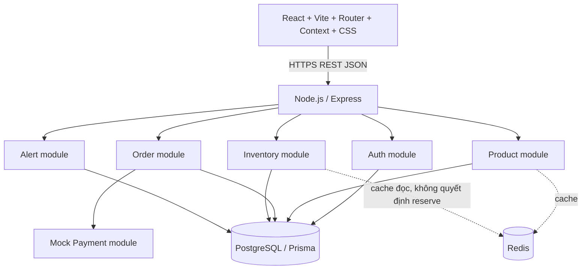
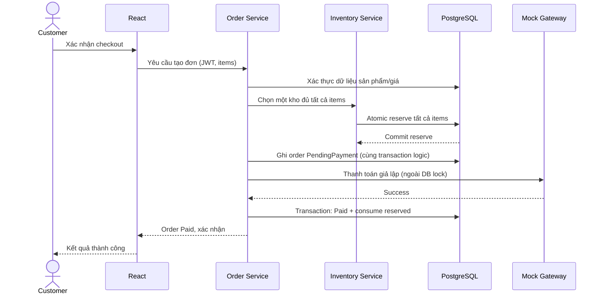
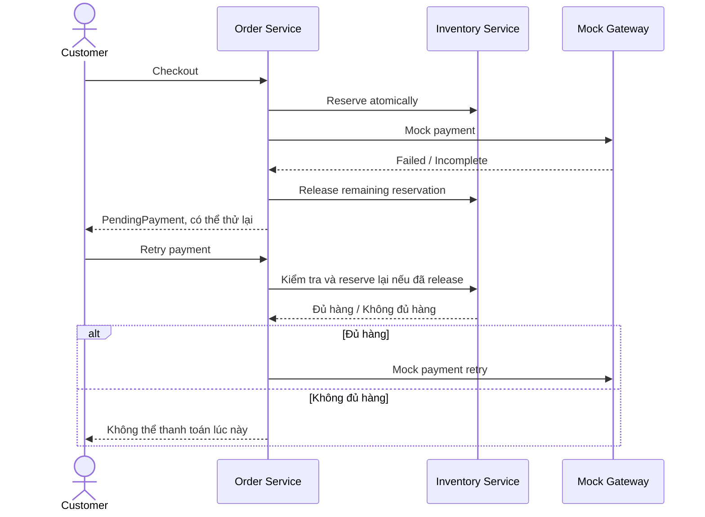
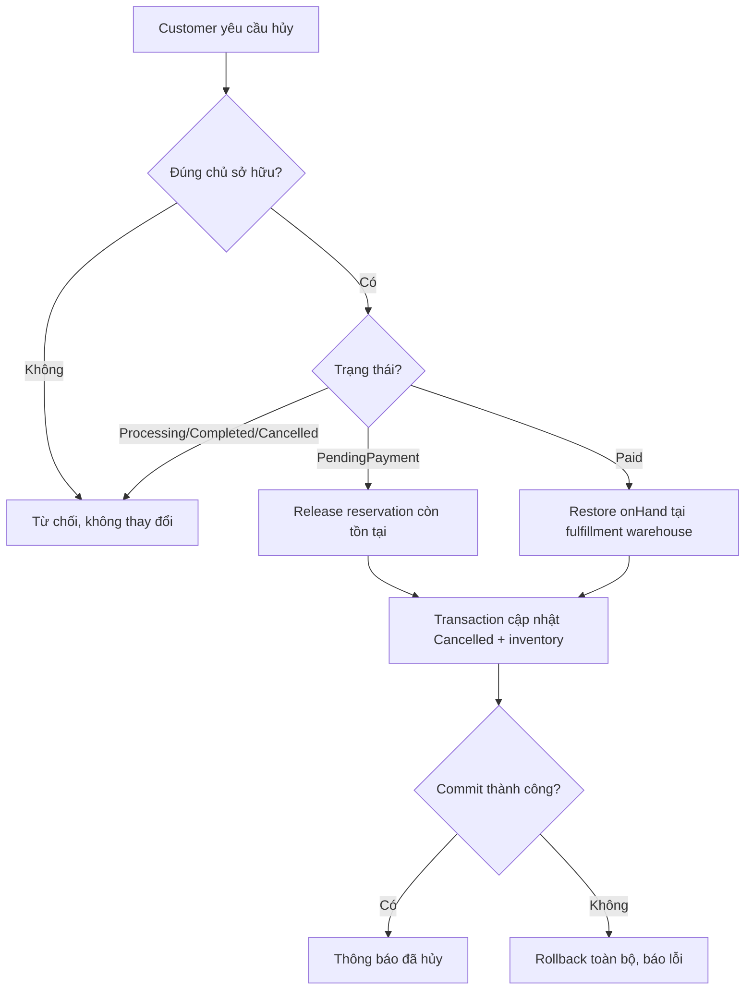

# HỆ THỐNG THƯƠNG MẠI ĐIỆN TỬ VÀ QUẢN LÝ TỒN KHO ĐA KHO
## Tài liệu tổng quan chuẩn hóa và bàn giao ngữ cảnh cho AI / thành viên phát triển

> **Trạng thái:** Tài liệu hợp nhất SRS từ `BaoCao_CNPM_Topic3.docx` (Phụ lục A, trang file 23–59), quyết định kiến trúc nhóm đã thống nhất và tình trạng triển khai đã trao đổi. Không được hiểu các đề xuất thiết kế chi tiết bên dưới là yêu cầu nguyên văn của SRS. **Ưu tiên khi mâu thuẫn:** SRS gốc → quyết định kiến trúc nhóm đã thống nhất (chỉ về cách thực hiện, không được trái SRS) → đề xuất triển khai trong tài liệu này → code hiện tại. Không được tuyên bố đã hoàn thành chức năng chỉ vì có route hoặc giao diện placeholder.

## 0. Chỉ dẫn bắt buộc cho AI mới

1. Đọc **toàn bộ** tài liệu trước khi thay đổi kiến trúc, dữ liệu, API hay nghiệp vụ.
2. Duy trì mọi mã yêu cầu `SR-*`, `NFR-*`, `BR-*` và `UC01–UC11`; liên hệ thay đổi code với các mã liên quan.
3. **Không tự ý** chia một đơn cho nhiều kho, cho phép oversell, khấu trừ hàng trước khi thanh toán thành công, bỏ kiểm tra ownership hoặc bỏ warehouse scope.
4. **Không coi Redis là nguồn sự thật tồn kho**; PostgreSQL là nguồn dữ liệu chuẩn. Không tin dữ liệu tồn kho, tổng tiền, role hoặc warehouseId do frontend tự khai.
5. Phân biệt **[SRS]** = yêu cầu trong Word, **[KT]** = quyết định kiến trúc nhóm, **[ĐX]** = đề xuất cần thống nhất, **[HT]** = hiện trạng đã trao đổi, chưa kiểm toán repository trực tiếp.
6. Khi thiếu thông tin, nêu giả định/điểm cần quyết định; không bịa thêm quy tắc nghiệp vụ. Không được suy diễn trạng thái triển khai thực tế từ bản thiết kế.
7. **Cách phối hợp với M1:** hướng dẫn **một bước nhỏ mỗi lần**, chờ M1 xác nhận rồi mới tiếp tục; trước khi sửa file hãy xin nội dung file hiện tại nếu chưa đọc được repo. Commit tiếng Việt theo mẫu `M1 - Vũ Minh Sơn: ...`.

## 1. Danh tính dự án, mục tiêu, phạm vi

- **Tên Việt:** Hệ thống thương mại điện tử và quản lý tồn kho đa kho.
- **Tên Anh:** Multi-Warehouse E-Commerce & Inventory Control System.
- **Môn:** Công nghệ phần mềm, Trường Đại học Tôn Đức Thắng, báo cáo cuối kỳ 2026.
- **Mục tiêu [SRS]:** Ứng dụng web cho khách mua sắm, quản lý giỏ, đặt hàng, thanh toán giả lập, theo dõi/hủy đơn; cho Warehouse Manager quan sát tồn kho đa kho, nhập bổ sung và cảnh báo; cho Administrator quản lý sản phẩm. Đặt hàng gắn chặt với tồn kho thực tế, không bán vượt.
- **Ngoài phạm vi [SRS]:** thanh toán tiền thật, tích hợp vận chuyển bên ngoài, thiết bị chuyên dụng kho (máy quét mã vạch, máy in tem).
- **Quy mô kiểm thử [SRS]:** 100–300 sản phẩm, 3 kho, tối thiểu 30 người dùng đồng thời.
- **Phân biệt:** Word hiện có các chương 1–9 chủ yếu là **đề mục chưa viết nội dung**; SRS ở Phụ lục A là nội dung đặc tả đầy đủ; Phụ lục B (BRD) mới là đề cương. Không gán nội dung tưởng tượng cho các chương/BRD còn trống.

## 2. Thành viên và phân công [KT/HT]

| Thành viên | MSSV | Phụ trách |
|---|---|---|
| M1 – Vũ Minh Sơn | 52400089 | Frontend storefront, tìm kiếm/chi tiết, giỏ hàng, checkout UI, Inventory Tracking Dashboard; tích hợp API giao diện |
| M2 – Trần Hồ Duy Ân | 52400065 | Nghiệp vụ đơn hàng, đặt hàng, mock payment, reservation, xử lý hủy/trạng thái |
| M3 – Nguyễn Anh Quân | 52400310 | Thiết kế DB, Prisma/PostgreSQL, transaction/concurrency, Redis, tầng lưu trữ |
| M4 – Phạm Đức Thiện | 52400318 | Test case, unit/integration/load test, đo P95, xác minh nghiệp vụ và phân quyền |

> Phân công trên là kế hoạch làm việc nhóm, không phải bảng phân công hoàn chỉnh từ Word (bảng ở chương 6 vẫn để trống nhiều cột). Các phần Auth, Admin, Alerts, Order Tracking/History, Restock cần nhóm chốt người sở hữu thực hiện và tích hợp; không mặc định chỉ một người sở hữu vì UI và backend khác nhau.

## 3. Người dùng và ma trận quyền [SRS]

| Tính năng | Khách vãng lai | Customer đã đăng nhập | Warehouse Manager | Administrator |
|---|---|---|---|---|
| Xem danh mục/tìm kiếm/chi tiết sản phẩm | Có (catalog công khai theo [KT]) | Có | Không phải chức năng chính của vai trò | Không phải chức năng chính của vai trò |
| Giỏ hàng | Có thể xem/thao tác giao diện theo [KT], checkout cần đăng nhập | Có | Không mặc định | Không mặc định |
| Checkout/mock payment | Không | Có, đơn của mình | Không | Không |
| Xem đơn/lịch sử/hủy | Không | Chỉ đơn của mình | Không | Không |
| Xem tồn kho từng kho và tổng hợp | Không | Không | **Tất cả kho** | Không tự mặc định cấp quyền |
| Nhập hàng/sửa tồn kho | Không | Không | **Chỉ kho được phân công** | Không tự mặc định cấp quyền |
| Đặt ngưỡng/xem cảnh báo | Không | Không | **Chỉ kho được phân công** | Không tự mặc định cấp quyền |
| Thêm/sửa/ngừng kinh doanh sản phẩm | Không | Không | Không | Có |

**Chú ý:** Không đồng nhất quyền *đọc tồn kho tất cả kho* với quyền *sửa tất cả kho*. Cả frontend lẫn backend cần xử lý phân quyền, nhưng **backend bắt buộc xác thực, kiểm tra role, ownership và kho được phân công** (`SR-AUTH-03..05`, `NFR-SEC-04..06`). Không dùng route guard phía client làm lớp bảo mật duy nhất.

## 4. Yêu cầu chức năng – danh mục truy vết đầy đủ [SRS]

| Nhóm | Mã | Hành vi bắt buộc | UC |
|---|---|---|---|
| Catalog | SR-CAT-01 | Hiển thị danh sách sản phẩm **đang kinh doanh** | UC02 |
| Catalog | SR-CAT-02 | Tìm kiếm theo **tên hoặc danh mục** | UC02 |
| Catalog | SR-CAT-03 | Chi tiết tên, giá, mô tả, trạng thái tồn kho | UC02 |
| Cart | SR-CART-01 | Thêm sản phẩm với số lượng mong muốn | UC03 |
| Cart | SR-CART-02 | Thay đổi số lượng trong giỏ | UC03 |
| Cart | SR-CART-03 | Xóa sản phẩm khỏi giỏ | UC03 |
| Cart | SR-CART-04 | Tính lại tổng tạm tính sau mọi thay đổi | UC03 |
| Payment | SR-PAY-01 | Gửi đơn và số tiền đến mock gateway | UC04 |
| Payment | SR-PAY-02 | Nhận kết quả thành công/thất bại | UC04 |
| Payment | SR-PAY-03 | Thành công thì xác nhận đơn | UC04 |
| Payment | SR-PAY-04 | Thất bại/không hoàn tất thì giải phóng hàng giữ | UC04 |
| Inventory | SR-INV-01 | Tồn kho riêng từng cặp sản phẩm–kho | UC05 |
| Inventory | SR-INV-02 | Quản lý Available Stock và Reserved Stock theo sản phẩm–kho | UC05 |
| Inventory | SR-INV-03 | Thanh toán thành công: chuyển hàng giữ thành hàng bán, cập nhật kho tương ứng | UC04 |
| Inventory | SR-INV-04 | Manager xem từng kho **và tổng hợp tất cả kho** | UC05 |
| Inventory | SR-INV-05 | Manager nhập bổ sung vào kho phụ trách | UC08 |
| Inventory | SR-INV-06 | Manager chỉ cập nhật tồn kho kho phụ trách | UC08 |
| Alert | SR-ALERT-01 | Đặt ngưỡng tối thiểu theo sản phẩm ở kho phụ trách | UC06 |
| Alert | SR-ALERT-02 | Tự động cảnh báo nếu available ≤ threshold | UC06 |
| Alert | SR-ALERT-03 | Chỉ hiển thị cảnh báo của kho được phân công | UC06 |
| Order | SR-ORD-01 | Checkout kiểm tra hàng khả dụng tại các kho | UC04 |
| Order | SR-ORD-02 | Chọn **duy nhất một kho** đủ **tất cả** mặt hàng | UC04 |
| Order | SR-ORD-03 | Giữ đủ hàng ở kho đã chọn **trước** thanh toán | UC04 |
| Product | SR-PROD-01 | Admin thêm sản phẩm | UC07 |
| Product | SR-PROD-02 | Admin sửa sản phẩm | UC07 |
| Product | SR-PROD-03 | Admin ngừng kinh doanh, không mất thông tin lịch sử đơn | UC07 |
| Tracking | SR-TRACK-01 | Lưu và cập nhật trạng thái đơn | UC09 |
| Tracking | SR-TRACK-02 | Customer xem chi tiết/trạng thái **đơn của mình** | UC09 |
| History | SR-HIS-01 | Lưu đơn đã đặt | UC10 |
| History | SR-HIS-02 | Lịch sử gồm sản phẩm, tổng tiền, trạng thái | UC10 |
| Cancellation | SR-CAN-01 | Chỉ hủy nếu PendingPayment hoặc Paid | UC11 |
| Cancellation | SR-CAN-02 | Hủy hợp lệ chuyển Cancelled | UC11 |
| Cancellation | SR-CAN-03 | Giải phóng/khôi phục tồn kho tại **kho thực hiện đơn** | UC11 |
| Cancellation | SR-CAN-04 | Trạng thái khác: từ chối, không thay đổi | UC11 |
| Auth | SR-AUTH-01 | Đăng nhập tài khoản hợp lệ | UC01 |
| Auth | SR-AUTH-02 | Xác định vai trò sau đăng nhập | UC01 |
| Auth | SR-AUTH-03 | Kiểm soát chức năng theo role và kho được phân công | UC01 |
| Auth | SR-AUTH-04 | Customer chỉ được truy cập đơn/lịch sử của mình | UC01/09/10/11 |
| Auth | SR-AUTH-05 | Xác định và kiểm tra kho được phân công của Manager | UC01/06/08 |

**Ghi chú thứ tự:** `SR-INV-05` nằm ở mục “Nhập bổ sung hàng vào kho” sau các mục Inventory khác trong bản Word; đây vẫn là cùng nhóm SR-INV, không phải mã thiếu.

## 5. Toàn bộ Use Case [SRS]

### UC01 – Đăng nhập và phân quyền (ưu tiên 1)
**Actor:** Customer, Warehouse Manager, Administrator. **Tiền điều kiện:** tài khoản hợp lệ. **Luồng:** mở login → nhập thông tin → máy chủ kiểm tra → xác định role và assigned warehouse (Manager) → tạo phiên đăng nhập → cho truy cập đúng phạm vi. **Ngoại lệ:** sai tài khoản; truy cập role/kho không được phép bị từ chối. **Liên kết:** SR-AUTH-01..05.

### UC02 – Duyệt, tìm kiếm, xem sản phẩm (ưu tiên 1)
Danh sách chỉ gồm sản phẩm đang kinh doanh; tìm theo tên/danh mục; chi tiết tên, giá, mô tả, tình trạng tồn kho. Không có kết quả thì thông báo; sản phẩm discontinued không hiện ở danh mục bán. **Liên kết:** SR-CAT-01..03.

### UC03 – Quản lý giỏ hàng (ưu tiên 1)
Thêm sản phẩm hợp lệ và số lượng hợp lệ → tính lại tạm tính → hiển thị; hỗ trợ đổi số lượng/xóa. Từ chối số lượng không hợp lệ hoặc sản phẩm ngừng kinh doanh. **Liên kết:** SR-CART-01..04. Giỏ hàng **không phải** reservation, chỉ checkout mới giữ hàng.

### UC04 – Đặt hàng và thanh toán (ưu tiên 1)
**Tiền điều kiện:** Customer đăng nhập; giỏ có ít nhất một sản phẩm hợp lệ. **Luồng chính:** kiểm tra available → chọn **một** kho đủ tất cả mặt hàng → giữ hàng → tạo order `PendingPayment` → gửi order/amount tới mock gateway → thành công → `Paid` và chuyển lượng reserved thành đã bán ở kho đó → thông báo xác nhận. **E1:** không kho nào đủ → thông báo, không tạo đơn. **E2:** reservation thất bại → không thanh toán, không để giữ dở. **E3:** mock payment thất bại → release reservation, **giữ order PendingPayment để thử lại**. **E4:** thanh toán không hoàn tất → release reservation, giữ PendingPayment. **Liên kết:** SR-ORD-01..03, SR-PAY-01..04, SR-INV-03.

**Điểm cần thiết kế cẩn thận [ĐX]:** khi retry một order PendingPayment đã được release, **phải kiểm tra và reserve lại atomically trước khi gọi mock payment**; không được giả định lượng hàng vẫn được giữ. Nếu không còn kho đủ hàng, từ chối retry hợp lệ, không oversell. Cần thống nhất có giữ nguyên kho đã chọn khi retry hay cho phép chọn lại kho mới; SRS không nêu cụ thể. Phải chống xử lý lặp kết quả thanh toán và double deduction.

### UC05 – Theo dõi tồn kho đa kho (ưu tiên 1)
Manager đăng nhập → chọn kho/sản phẩm → xem available và reserved theo từng sản phẩm–kho → có chế độ tổng hợp **toàn hệ thống**. Chỉ đọc, không thay đổi tồn kho. Không dữ liệu/lỗi truy xuất thì báo rõ. **Liên kết:** SR-INV-01/02/04.

### UC06 – Quản lý cảnh báo tồn kho thấp (ưu tiên 1)
Manager đăng nhập, assigned warehouse → chọn sản phẩm tại **kho của mình** → nhập ngưỡng hợp lệ → lưu → khi available thay đổi và `available <= threshold`, tự động tạo cảnh báo → chỉ manager kho đó thấy. Nếu available cao hơn ngưỡng không tạo cảnh báo mới. Từ chối ngưỡng sai hoặc thao tác kho khác. **Liên kết:** SR-ALERT-01..03, SR-AUTH-05.

### UC07 – Quản lý sản phẩm (ưu tiên 1)
Admin thêm mới (tên, giá, mô tả, danh mục); có luồng sửa; ngừng kinh doanh bằng thay đổi trạng thái, **không xóa dữ liệu lịch sử đơn**. Xử lý đầu vào sai, sản phẩm không tồn tại, lỗi ghi DB. **Liên kết:** SR-PROD-01..03.

### UC08 – Nhập bổ sung hàng vào kho (ưu tiên 2)
Manager đăng nhập, có kho được phân công, sản phẩm đã tồn tại → chọn sản phẩm và số lượng nhập → kiểm tra số lượng/role/kho → cập nhật tồn kho **chỉ tại kho của mình** → thông báo. Lỗi thì không thay đổi dữ liệu. **Liên kết:** SR-INV-05/06, SR-AUTH-05.

### UC09 – Theo dõi đơn hàng (ưu tiên 2)
Customer đăng nhập → danh sách đơn của mình → chọn đơn → backend kiểm tra ownership → xem chi tiết và trạng thái. Không tìm thấy/không thuộc mình/lỗi truy vấn → thông báo hoặc từ chối. **Liên kết:** SR-TRACK-01/02, SR-AUTH-04.

### UC10 – Xem lịch sử mua hàng (ưu tiên 2)
Customer đăng nhập → backend truy vấn đơn của mình → danh sách sản phẩm, tổng tiền, trạng thái → có thể xem chi tiết; xử lý trường hợp chưa có đơn và không được xem đơn người khác. **Liên kết:** SR-HIS-01/02, SR-AUTH-04.

### UC11 – Hủy đơn hàng (ưu tiên 2)
Customer đăng nhập → chọn đơn của mình → xác minh ownership và trạng thái → chỉ cho hủy `PendingPayment` hoặc `Paid` → yêu cầu xác nhận → nếu PendingPayment giải phóng lượng **còn giữ nếu có**, nếu Paid **hoàn trả on-hand đã trừ tại kho xử lý đơn** → chuyển `Cancelled` → thông báo. Không xác nhận thì không thay đổi. `Processing`, `Completed`, `Cancelled` không được hủy. **Cập nhật order + inventory trong cùng transaction**; lỗi phải rollback toàn bộ. **Liên kết:** SR-CAN-01..04, SR-AUTH-04.

## 6. Quy tắc kinh doanh [SRS, BR-01..BR-12]

| Mã | Quy tắc không được phá vỡ |
|---|---|
| BR-01 | Mỗi đơn **một kho** đủ tất cả mặt hàng, không split fulfillment |
| BR-02 | Kiểm tra và reserve trước mock payment |
| BR-03 | Thanh toán thành công: reserved → sold, cập nhật kho, order `Paid` |
| BR-04 | Thất bại/không hoàn tất: release, order vẫn `PendingPayment` để retry |
| BR-05 | Customer chỉ hủy đơn **của mình**, chỉ ở `PendingPayment`/`Paid` |
| BR-06 | Hủy PendingPayment: release phần còn reserved; hủy Paid: hoàn trả hàng đã trừ |
| BR-07 | Cảnh báo nếu `available <= threshold` tại một kho |
| BR-08 | Manager xem tồn kho **mọi kho và tổng hợp** |
| BR-09 | Manager chỉ nhập/sửa kho mình và thiết lập threshold tại kho mình |
| BR-10 | Manager chỉ xem cảnh báo kho mình |
| BR-11 | Trạng thái `PendingPayment`, `Paid`, `Processing`, `Completed`; `Cancelled` khi được phép |
| BR-12 | Giữ hàng, cập nhật tồn kho, hủy đơn phải nhất quán; **zero overselling** |

## 7. State machine đơn hàng [SRS + diễn giải giới hạn]

```mermaid
stateDiagram-v2
    [*] --> PendingPayment: Reserve thành công và tạo đơn
    PendingPayment --> Paid: Mock payment thành công
    PendingPayment --> PendingPayment: Payment fail / incomplete; release reservation
    PendingPayment --> Cancelled: Customer hủy đơn hợp lệ
    Paid --> Processing: Bước xử lý đơn
    Processing --> Completed: Hoàn tất
    Paid --> Cancelled: Customer hủy đơn hợp lệ, restore stock
```

**[SRS]** BR-11 liệt kê các trạng thái; UC04 và UC11 mô tả rõ việc vào PendingPayment/Paid/Cancelled, và cấm hủy Processing/Completed/Cancelled. **[ĐX]** Các mũi tên `Paid → Processing → Completed` thể hiện tiến trình tự nhiên theo BR-11, nhưng **SRS chưa quy định actor/API/cơ chế chuyển trạng thái**; nhóm cần quyết định, không tự ý tạo quyền cập nhật trạng thái cho Manager/Admin. Thanh toán fail **không** biến order thành Failed hoặc Cancelled. Retry phải đảm bảo không double charge/double deduct (mock).

## 8. Mô hình tồn kho và invariant [KT phù hợp SRS]

Theo từng `(warehouseId, productId)`:

- `onHand`: số hàng vật lý được ghi nhận.
- `reserved`: số lượng đang giữ cho đơn chưa hoàn tất thanh toán.
- `available = onHand - reserved` (không lưu available như nguồn sự thật độc lập nếu có thể tính từ dữ liệu chuẩn).
- Bất biến: `onHand >= 0`, `reserved >= 0`, `reserved <= onHand`, `available >= 0`.

| Sự kiện | onHand | reserved | available |
|---|---:|---:|---:|
| Trước đặt hàng | H | R | H − R |
| Reserve q | H | R + q | H − R − q |
| Payment thành công q | H − q | R − q | H − R (không đổi so với ngay trước success) |
| Payment fail / release q | H | R − q | H − R + q |
| Hủy Paid q | H + q | R | H − R + q |
| Restock q | H + q | R | H − R + q |

Ví dụ: kho A có onHand=10, reserved=2, available=8. Đặt 3 → (10,5,5); trả tiền thành công → (7,2,5); hủy Paid → (10,2,8). **Không được trừ onHand ngay ở bước reserve**.

**[KT/ĐX] Transaction & concurrency:** chọn kho và reserve bằng PostgreSQL transaction + conditional update/locking thích hợp để 30 người cùng đặt không oversell; reserve tất cả order items theo nguyên tắc all-or-nothing. Ghi `fulfillmentWarehouseId` lên order để hoàn trả đúng kho. Commit reservation/order trước khi gọi mock gateway; **không giữ DB transaction/row lock trong lúc chờ gateway**. Payment success/fail và cancel cần transaction idempotent; nếu có callback lặp, không được trừ hay hoàn hàng hai lần. Redis cache phải invalidate hoặc cập nhật phù hợp, không dùng cache làm quyết định tồn kho cuối cùng.

## 9. Kiến trúc và công nghệ [KT]

### 9.1. Bốn góc nhìn bổ sung nhau, không mâu thuẫn

1. **Client–Server:** trình duyệt React gửi HTTPS/JSON REST API tới Express server.
2. **3-Tier:** Presentation (React) / Business Logic (Express services) / Data (PostgreSQL, Redis cache).
3. **Modular Monolith:** một backend triển khai thống nhất, tách module nghiệp vụ Auth, Product, Cart (nếu cần server-side), Order, Payment, Inventory, Alert.
4. **Layered trong mỗi module:** `Route → Controller → Service → Repository/Prisma → PostgreSQL`; service sở hữu nghiệp vụ và transaction. Không gọi mô hình này là MVC theo kiến trúc đã chốt.

### 9.2. Stack cố định đã thống nhất

| Tầng | Công nghệ |
|---|---|
| Frontend | React, Vite, **JavaScript**, React Router, React Context, CSS thuần |
| Backend | Node.js, Express, REST API, JSON |
| Database | PostgreSQL + Prisma ORM |
| Cache | Redis, chỉ cache dữ liệu thích hợp |
| Auth | JWT, bcrypt (SRS cho phép bcrypt hoặc Argon2; nhóm chọn bcrypt) |
| Payment | Mock payment, không có giao dịch tiền thật |
| Test | Vitest, Supertest, k6, Postman |
| Version control | Git, GitHub; feature branches, PR vào develop |

**[SRS]** HTTP API/JSON, HTTPS/TLS, Redis cache, password hashing, mock payment. **[KT]** lựa chọn React/Vite/Express/Prisma/Postgres/JWT và cách phân lớp là quyết định của nhóm, không nên nói SRS Word yêu cầu chính xác những framework này.

### 9.3. Hợp đồng giữa các module (thiết kế định hướng, CHƯA chốt API [ĐX])

- Auth cung cấp `userId`, `role`, `assignedWarehouseId` đã được xác thực ở server.
- Product cung cấp danh mục active, tìm kiếm, chi tiết; snapshot tên/giá ở order items để lịch sử không đổi khi admin sửa hoặc ngừng bán.
- Inventory cung cấp đọc toàn kho/tổng hợp; atomic reserve/release/consume/restore/restock; check threshold.
- Order orchestrates checkout, lưu items và fulfillment warehouse, state machine, ownership, cancellation.
- Payment mô phỏng success/fail/incomplete; xử lý idempotency, không chứa thông tin thẻ thật.
- Alert nhận biết available thay đổi và sinh/hiển thị cảnh báo đúng warehouse scope.
- Cart frontend quản lý giỏ hiện tại; backend **phải tự kiểm lại** sản phẩm, giá, số lượng, tồn kho khi checkout.

**Không tự coi tên endpoint hay tên bảng sau đây là đã chốt:** ví dụ `POST /api/orders`, `POST /api/orders/:id/pay`, `POST /api/orders/:id/cancel`, `GET /api/inventory`, `GET /api/inventory/alerts`, `PATCH /api/inventory/:warehouseId/restock` chỉ là phác thảo để nhóm chốt contract. M2/M3/M1 phải đồng thuận request/response/error trước khi tích hợp.

### 9.4. ERD tối thiểu đề xuất [ĐX], chưa phải ERD chính thức

- `User(id, role, passwordHash, assignedWarehouseId?)`.
- `Warehouse(id, name, ...)`.
- `Product(id, name, category, price, description, isActive, ...)`.
- `Inventory(warehouseId, productId, onHand, reserved, lowStockThreshold, ...)`, unique `(warehouseId, productId)`.
- `Order(id, customerId, fulfillmentWarehouseId, status, totalAmount, ...)`.
- `OrderItem(id, orderId, productId, productNameSnapshot, unitPriceSnapshot, quantity, ...)`.
- `PaymentAttempt(id, orderId, result, idempotencyKey?, ...)` và/hoặc `StockReservation`/audit log nếu cần retry/reconciliation.
- `LowStockAlert` nếu chọn lưu cảnh báo thay vì tính động; phải chốt chống trùng và trạng thái xử lý.

**Điểm chưa được Word quy định chi tiết:** chiến lược chọn kho nếu nhiều kho đủ hàng; chính sách hết hạn reservation; xử lý payment timeout đến muộn; thời gian giữ đơn; cơ chế cập nhật Processing/Completed; định dạng số điện thoại/địa chỉ; thuế/phí ship; cấu trúc API chính xác; lược đồ DB cụ thể. Không tự khẳng định các quyết định này là SRS.

## 10. NFR – tiêu chí nghiệm thu có thể đo [SRS]

| Mã | Tiêu chí |
|---|---|
| NFR-PER-01 | P95 xem danh sách/tìm kiếm/chi tiết **≤ 3 giây** |
| NFR-PER-02 | P95 thêm/sửa/xóa giỏ **≤ 2 giây** |
| NFR-PER-03 | P95 nhận checkout → kiểm kho/chọn kho/reserve **≤ 5 giây**, **không tính** mock gateway |
| NFR-PER-04 | Tối thiểu **30 concurrent users**, vẫn đạt ngưỡng P95 |
| NFR-PER-05 | **Không oversell** ở bất kỳ kho nào dưới concurrency |
| NFR-PER-06 | Dùng Redis cache phù hợp nhưng đảm bảo đúng tồn kho |
| NFR-SEC-01 | Hash mật khẩu bằng bcrypt hoặc Argon2, không lưu plaintext |
| NFR-SEC-02 | HTTPS/TLS |
| NFR-SEC-03 | Xác thực trước chức năng cần login |
| NFR-SEC-04 | Server-side RBAC 3 vai trò |
| NFR-SEC-05 | Manager xem mọi tồn kho, chỉ sửa/ngưỡng/cảnh báo kho mình |
| NFR-SEC-06 | Server kiểm tra ownership đơn |
| NFR-SEC-07 | Validate input server-side, parameterized queries chống SQL injection |
| NFR-SEC-08 | Mock payment; không lưu thẻ thật |
| NFR-REL-01 | Reserve/payment/inventory nhất quán; rollback khi giao dịch lỗi |
| NFR-REL-02 | Payment fail/incomplete release, không chuyển Paid |
| NFR-REL-03 | Cancel + inventory trong **cùng transaction** |
| NFR-REL-04 | Có backup và restore DB |
| NFR-REL-05 | Lỗi DB/xử lý phải báo phù hợp, không ghi giao dịch chưa hoàn tất là thành công |
| NFR-REL-06 | Chạy thử liên tục **8 giờ**, phục vụ ≥ **99%** thời gian, trừ bảo trì có kế hoạch |
| NFR-USA-01 | Các chức năng chính dễ tìm, tên rõ |
| NFR-USA-02 | Thông báo thành công/thất bại thao tác quan trọng |
| NFR-USA-03 | Validation feedback tại form |
| NFR-USA-04 | Giao diện theo vai trò |
| NFR-POR-01 | Hai phiên bản ổn định mới nhất Chrome và Edge tại thời điểm kiểm thử |
| NFR-POR-02 | Responsive từ **375px**, bố cục chính không scroll ngang |
| NFR-POR-03 | Có hướng dẫn setup/config/run để triển khai lại |

**Đo hiệu năng:** dataset 100–300 sản phẩm, 3 kho, ≥30 virtual users, báo cáo P95 riêng catalog/cart/reservation; không lấy thời gian mock gateway để kết luận NFR-PER-03. Chứng minh zero oversell bằng kiểm tra invariant DB sau load test, không chỉ bằng HTTP 200.

## 11. Luồng hoạt động và sequence diagrams tham khảo [SRS logic + KT]

### 11.1. Checkout thành công

**Lưu ý kỹ thuật:** hình trên minh họa thứ tự nghiệp vụ, không phải chỉ dẫn tách reservation và tạo order thành hai commit độc lập. **Reservation và tạo order phải được thiết kế nguyên tử** để không có hàng giữ mồ côi nếu lưu order lỗi.

### 11.2. Payment fail/incomplete và retry

### 11.3. Cancel

## 12. Giao diện cần có và định hướng route [SRS + HT]

| Vai trò | Trang / màn hình | Gắn UC |
|---|---|---|
| Customer | Login | UC01 |
| Customer | Danh mục, tìm kiếm, chi tiết sản phẩm | UC02 |
| Customer | Giỏ hàng | UC03 |
| Customer | Checkout, mock payment, kết quả đơn | UC04 |
| Customer | Theo dõi trạng thái đơn | UC09 |
| Customer | Lịch sử mua hàng | UC10 |
| Customer | Hủy đơn tại màn hình chi tiết/tracking | UC11 |
| Manager | Inventory Tracking Dashboard: all warehouses + aggregate | UC05 |
| Manager | Ngưỡng và cảnh báo kho mình | UC06 |
| Manager | Nhập bổ sung kho mình | UC08 |
| Admin | Danh sách/thêm/sửa/ngừng kinh doanh sản phẩm | UC07 |

**Các route frontend đã trao đổi [HT]:** `/products`, `/products/:productId`, `/cart`, `/checkout`, `/order-result`, `/orders`, `/orders/:orderId`, `/inventory`, `/inventory/warehouses`, `/inventory/alerts`, `/admin/products`, `/admin/products/add`, `/admin/products/:productId/edit`, `/admin/products/:productId/discontinue`, `/login`, `*`. Route chỉ là giao diện, không chứng minh backend đã hoạt động.

## 13. Hiện trạng repo tại thời điểm bàn giao [HT – CHƯA KIỂM TOÁN]

- GitHub: `https://github.com/vuminhson87/multi-warehouse-e-commerce-inventory-control-system`.
- Local Windows: `D:\CongNghePhanMem\multi-warehouse-e-commerce-inventory-control-system`.
- `main` ổn định, `develop` tích hợp, `feature/...` làm từng tính năng → PR vào `develop` → merge `main` gần lúc nộp. Không force push, không xóa feature branches.
- Nhánh M1 gần nhất: `feature/m1-checkout-ui`, tạo từ `develop`, **chưa có checkout UI mới** tại thời điểm trao đổi.
- Đã có React app, route/pages, CustomerHeader, `AuthContext`, `CartContext`, mock users và mock products.
- UI catalog/search/chi tiết/cart và đăng nhập role giả lập đã có phiên bản frontend; **chưa phải backend integration**. Cart/Auth Context có thể mất state khi reload; chưa chốt xử lý persistence.
- Checkout, OrderResult, InventoryDashboard, WarehouseInventory, Alerts, ProductManagement, Tracking, History và các trang khác đã có route/placeholder, **không được đánh dấu hoàn thành**.
- `CartContext` đã trao đổi có `cartItems`, `addToCart`, `increaseQuantity`, `decreaseQuantity`, `removeFromCart`; mỗi item có `id`, `price`, `quantity` và trường khác. Trước khi sửa phải kiểm tra source hiện tại.
- Mock users Customer/Manager/Admin dùng password `123456` chỉ để demo frontend; **không dùng plaintext password này trong production DB**.
- Mock sản phẩm từng dùng: Dell Inspiron 15, Logitech G304, Keychron K2 (out of stock). Đây là seed/demo, **không phải** sản phẩm bắt buộc trong SRS.
- Tài liệu cũ trên repo `docs/Tong_quan_day_du_Multi_Warehouse_ECommerce.md` là tài liệu tiền nhiệm; **tài liệu này** được viết để làm chuẩn ngữ cảnh thống nhất. Cần kiểm tra trước khi thay thế hoặc commit.

## 14. Kế hoạch triển khai tích hợp và ranh giới trách nhiệm [ĐX]

1. **M3 + M2 chốt DB & contract:** product/warehouse/inventory/order/order item/payment; uniqueness; transaction; status; retry/cancel; payload/errors. Ghi rõ warehouse-selection rule nếu có nhiều kho đủ hàng.
2. **M1 dựng checkout UI theo UC04**: hiển thị giỏ/tổng, kiểm tra đăng nhập, trạng thái loading, no-stock, reservation fail, payment success/fail/incomplete, retry, điều hướng result; không giả lập tồn kho như sự thật sau khi tích hợp.
3. **M2 triển khai order orchestration/mock payment**; M3 hỗ trợ atomic inventory operations; phối hợp owner Auth và Alerts.
4. **M1 triển khai Inventory Dashboard UC05**: đọc tất cả kho, filter theo kho/sản phẩm, hiển thị onHand/reserved/available và aggregate; phân biệt giao diện đọc với chức năng nhập hàng kho mình.
5. **Bổ sung UC06–UC11** với phân quyền server-side và test; không bỏ qua các Use Case ưu tiên 2.
6. **M4 test** theo từng SR/BR/NFR và chứng minh không oversell, đúng ownership/scope, rollback/idempotency, P95, responsiveness.

### Definition of Done cho từng tính năng

- Có mã SR/UC/BR liên quan; xử lý main + alternative + exception flow.
- Có validation, loading, empty, success, error states trên UI.
- Có authorization ở backend nếu cần; không tin dữ liệu nhạy cảm từ frontend.
- DB/transaction không phá invariant; có test success/fail/concurrency nếu là inventory/order.
- Có test evidence/README hướng dẫn; PR review vào `develop` và không làm hỏng chức năng khác.

## 15. Danh sách kiểm thử trọng yếu [SRS → test cases]

| ID test gợi ý | Kịch bản | Kỳ vọng |
|---|---|---|
| T01 | Tìm tên/danh mục, xem chi tiết | Đúng sản phẩm active; đủ tên/giá/mô tả/trạng thái |
| T02 | Thêm/sửa/xóa giỏ, số lượng sai | Tổng tính lại; số lượng sai bị từ chối |
| T03 | Giỏ có hai mặt hàng, mỗi kho chỉ đủ một mặt hàng | **Không tạo đơn**, không split |
| T04 | Một kho đủ toàn bộ giỏ | Atomic reserve, PendingPayment |
| T05 | Payment success | Paid, onHand và reserved giảm đúng q, không double deduct |
| T06 | Payment fail/incomplete | Release; PendingPayment; có thể retry |
| T07 | Retry sau release khi hàng đã hết | Không Paid, không oversell |
| T08 | 30 users cùng mua số lượng giới hạn | Tổng đã bán ≤ stock khả dụng ban đầu (tính cả restock hợp lệ) |
| T09 | Manager A xem tồn kho B | Cho phép đọc |
| T10 | Manager A sửa/restock/threshold B | Server từ chối, DB không đổi |
| T11 | Manager A xem cảnh báo B | Server từ chối/không tiết lộ |
| T12 | Available đúng bằng threshold | Phải cảnh báo |
| T13 | Customer A xem/hủy đơn B | Server từ chối |
| T14 | Cancel PendingPayment còn reserved | Release đúng phần còn giữ, Cancelled |
| T15 | Cancel Paid | Restore đúng kho, Cancelled, atomic |
| T16 | Cancel Processing/Completed/Cancelled | Từ chối, không đổi |
| T17 | Admin ngừng kinh doanh sản phẩm đã bán | Catalog ẩn; order history còn nguyên snapshot |
| T18 | DB lỗi giữa cancel và restore | Rollback toàn bộ |
| T19 | Callback/payment response lặp | Không double consume/restore |
| T20 | Chrome/Edge, viewport 375px | Không scroll ngang bố cục chính |
| T21 | Load test 100–300 products, 3 warehouses, 30 VUs | Đạt P95 3s/2s/5s đúng phạm vi |
| T22 | Soak test 8h và backup/restore | Availability ≥99% trừ maintenance; restore được DB |

## 16. Những điểm cần chốt trước khi AI tự triển khai [ĐX – không có câu trả lời trực tiếp trong Word]

- **Kho nào được chọn** nếu có từ hai kho cùng đủ toàn bộ đơn? (Ví dụ ưu tiên ID nhỏ nhất là lựa chọn kỹ thuật, không phải yêu cầu SRS.)
- **Retry payment** sau release: giữ nguyên fulfillment warehouse hay chọn lại? Có cần reservation TTL? Xử lý callback muộn thế nào?
- **Processing/Completed**: ai được chuyển, trigger khi nào, API nào? SRS chỉ nêu trạng thái.
- **Địa chỉ giao hàng, phí ship, thuế, voucher, tồn kho hiển thị ở catalog**: Word không đặc tả chi tiết, không tự bổ sung thành yêu cầu bắt buộc.
- **Alert lifecycle:** lưu DB hay tính động, cách chống trùng, giải quyết alert khi restock; Word chỉ yêu cầu tự động tạo khi available ≤ threshold và quyền xem đúng kho.
- **Chi tiết database/API:** chốt theo hợp đồng chung trước khi chia code cho M1/M2/M3.
- **Phân công UI/backend** cho UC06–UC11, Auth và Admin cần rõ người phụ trách.
- **Sơ đồ chính thức:** mục 6 SRS mới có đề mục Activity/ERD/Class, chưa có nội dung; các Mermaid trong tài liệu này là **sơ đồ tái dựng để hỗ trợ phát triển**, chưa phải sơ đồ được chèn trong báo cáo Word.

## 17. Quy trình Git và giao tiếp [KT/HT]

- Branches: `main` → `develop` → `feature/<thanh-vien>-<chuc-nang>`; PR `feature` → `develop`.
- Trước khi thay đổi: `git status`, xác nhận branch, đọc file đang sửa; tránh ghi đè thay đổi của người khác.
- Sau một thay đổi nhỏ: chạy/test; commit có thông điệp rõ, push feature branch, tạo PR nếu phù hợp.
- PowerShell trên Windows: có thể dùng `npm.cmd` khi `npm` bị ExecutionPolicy chặn.
- M1 muốn AI **chỉ đưa một bước nhỏ**, chờ kết quả/xác nhận trước bước tiếp theo.

## 18. Bản đồ nguồn gốc / ưu tiên tham khảo

| Phần | Nguồn trong Word |
|---|---|
| Phạm vi, vai trò, giới hạn | SRS §1–2, trang file 24–28 |
| UI/phần mềm/HTTPS/API/JSON/Redis | SRS §3, trang file 29–31 |
| Danh mục toàn bộ SR | SRS §4.1, trang file 31–35 |
| Bảng 11 Use Case | SRS §4.2, trang file 35–37 |
| Chi tiết UC01–UC11 | SRS §4.3, trang file 37–53 |
| NFR-PER/SEC/REL/USA/POR | SRS §5.1–5.4, trang file 54–58 |
| BR-01..12 | SRS §5.5, trang file 58–59 |
| Mô hình phân tích | SRS §6, trang file 59: chỉ có đề mục |
| BRD | Phụ lục B, trang file 60–62: đề cương chưa triển khai |
| Stack, module, Git, hiện trạng M1 | Quyết định và trao đổi nhóm đã thống nhất, **không trích nguyên văn từ Word** |

---

**Quy tắc kết thúc cho AI mới:** Trước mỗi tính năng, nêu mã SR/UC/BR áp dụng, kiểm tra code thật và trạng thái branch, làm theo kiến trúc đã chốt, phân biệt bắt buộc/đề xuất, xác nhận các điểm còn mơ hồ thay vì đoán. Đối với M1, chỉ hướng dẫn **một bước** rồi chờ phản hồi.
