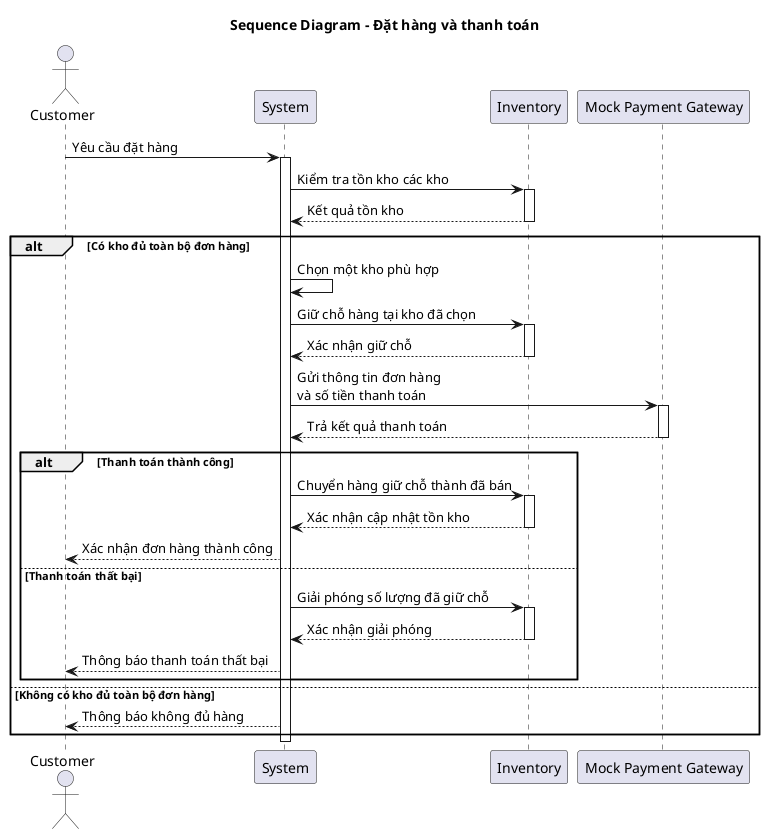
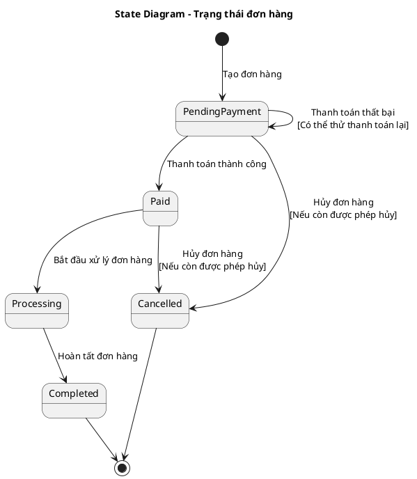

# MULTI-WAREHOUSE E-COMMERCE & INVENTORY CONTROL SYSTEM

## 1. Thông tin đề tài

**Tên đề tài:** Multi-Warehouse E-Commerce & Inventory Control System  
**Lĩnh vực:** Retail & Supply Chain  

Hệ thống là một nền tảng thương mại điện tử kết hợp quản lý tồn kho tại nhiều kho/khu vực. Khách hàng có thể duyệt sản phẩm, quản lý giỏ hàng, đặt hàng và thanh toán qua cổng thanh toán giả lập. Khi checkout, hệ thống kiểm tra tồn kho tại các kho, chọn **một kho duy nhất có đủ toàn bộ sản phẩm trong đơn hàng**, giữ chỗ hàng tại kho đó và cập nhật tồn kho theo kết quả thanh toán.

Bên cạnh luồng mua hàng, hệ thống hỗ trợ Warehouse Manager theo dõi tồn kho, quản lý ngưỡng cảnh báo tồn thấp và nhập bổ sung hàng; Administrator quản lý danh mục sản phẩm.

---

## 2. Mục tiêu hệ thống

- Xây dựng storefront cho phép khách hàng duyệt, tìm kiếm và xem chi tiết sản phẩm.
- Hỗ trợ giỏ hàng và quy trình checkout.
- Tích hợp Mock Payment Gateway để mô phỏng thanh toán thành công/thất bại.
- Quản lý tồn kho riêng biệt trên nhiều warehouse.
- Hỗ trợ stock reservation nhằm hạn chế overselling khi nhiều đơn hàng được xử lý đồng thời.
- Theo dõi tồn kho khả dụng và tồn kho đang giữ chỗ.
- Cảnh báo khi tồn kho xuống thấp hơn hoặc bằng ngưỡng cấu hình.
- Hỗ trợ theo dõi đơn hàng, lịch sử mua hàng và hủy đơn theo trạng thái cho phép.
- Hỗ trợ quản lý sản phẩm và nhập bổ sung hàng.
- Xác thực người dùng và phân quyền theo role.

---

## 3. Phạm vi hệ thống

### 3.1. Các chức năng chính

1. Product Catalog Browsing – Duyệt, tìm kiếm và xem sản phẩm.
2. Shopping Cart – Quản lý giỏ hàng.
3. Mock Payment Gateway Integration – Thanh toán giả lập.
4. Multi-Warehouse Inventory & Stock Reservation – Quản lý và giữ hàng đa kho.
5. Low-Stock Alerting – Cảnh báo tồn kho thấp.
6. Inventory Tracking Dashboard – Theo dõi tồn kho theo kho và tổng hợp.
7. Order Tracking – Theo dõi đơn hàng.
8. Product Management – Quản lý sản phẩm.
9. Warehouse Restocking – Nhập bổ sung hàng vào kho.
10. Purchase History – Xem lịch sử mua hàng.
11. Order Cancellation – Hủy đơn hàng.
12. Authentication & Role-based Authorization – Đăng nhập và phân quyền theo role.

### 3.2. Ngoài phạm vi hiện tại

- Thanh toán tiền thật; hệ thống chỉ sử dụng Mock Payment Gateway.
- Tích hợp vận chuyển/logistics thực tế.
- Voucher, loyalty, review/rating, promotion phức tạp.
- OAuth, 2FA, OTP, email verification và các chức năng quản lý tài khoản nâng cao.
- Chia một đơn hàng cho nhiều warehouse cùng fulfillment.
- Luân chuyển hàng giữa các warehouse hiện được xem là hướng mở rộng, chưa nằm trong luồng fulfillment chính.

---

## 4. Actors và phân quyền

### 4.1. Customer

- Đăng nhập hệ thống.
- Duyệt/tìm kiếm/xem sản phẩm.
- Quản lý giỏ hàng.
- Đặt hàng và thanh toán.
- Theo dõi đơn hàng.
- Xem lịch sử mua hàng.
- Hủy đơn hàng khi trạng thái cho phép.
- Chỉ được truy cập đơn hàng và lịch sử của chính mình.

### 4.2. Warehouse Manager

- Đăng nhập hệ thống.
- Theo dõi tồn kho theo từng warehouse và tồn kho tổng hợp.
- Xem Available/Reserved Stock.
- Thiết lập ngưỡng tồn kho tối thiểu theo sản phẩm và warehouse.
- Nhận/xem cảnh báo tồn kho thấp.
- Nhập bổ sung hàng vào warehouse.

### 4.3. Administrator

- Đăng nhập hệ thống.
- Thêm sản phẩm.
- Chỉnh sửa sản phẩm.
- Ngừng kinh doanh sản phẩm mà không làm mất dữ liệu lịch sử đơn hàng.

### 4.4. Mock Payment Gateway

External system mô phỏng việc xử lý thanh toán và trả kết quả thành công/thất bại cho hệ thống.

---

## 5. Business Rules đã thống nhất

### BR-01 – Single-Warehouse Fulfillment

Mỗi đơn hàng chỉ được fulfillment bởi **một warehouse duy nhất**. Warehouse được chọn phải có đủ số lượng khả dụng của **tất cả sản phẩm** trong đơn hàng.

Nếu tổng tồn kho của nhiều warehouse đủ nhưng không có warehouse riêng lẻ nào đủ toàn bộ đơn hàng, checkout hiện tại được xem là không đủ hàng.

### BR-02 – Stock Reservation

Sau khi xác định warehouse phù hợp, hệ thống giữ chỗ số lượng sản phẩm cần thiết tại warehouse đó trước khi gửi yêu cầu thanh toán.

Nếu thanh toán thất bại hoặc không hoàn tất, lượng hàng đã giữ chỗ phải được giải phóng.

### BR-03 – Order Lifecycle

Các trạng thái đơn hàng hiện tại:

`PendingPayment -> Paid -> Processing -> Completed`

Ngoài ra, đơn có thể chuyển sang `Cancelled` từ `PendingPayment` hoặc `Paid` khi được phép hủy.

- `PendingPayment`: đơn đã được tạo và đang chờ thanh toán.
- `Paid`: thanh toán đã thành công nhưng đơn chưa bắt đầu xử lý.
- `Processing`: đơn đang được xử lý.
- `Completed`: đơn đã hoàn tất.
- `Cancelled`: đơn đã bị hủy.

Nếu thanh toán thất bại, đơn vẫn ở `PendingPayment` và có thể thử thanh toán lại.

### BR-04 – Cancellation

Customer được phép yêu cầu hủy khi đơn ở `PendingPayment` hoặc `Paid`. Khi đơn đã ở `Processing` hoặc `Completed`, yêu cầu hủy bị từ chối.

Chi tiết cách giải phóng/hoàn tồn kho ở từng trường hợp sẽ phụ thuộc Inventory Model được chuẩn hóa ở bước thiết kế tiếp theo.

### BR-05 – Authentication & Authorization

Hệ thống có đăng nhập và phân quyền theo role. Sau khi xác thực thành công, hệ thống xác định role của tài khoản và chỉ cho phép truy cập chức năng tương ứng.

---

# 6. USER REQUIREMENTS

## 6.1. Customer Requirements

Customer có thể:

- Tìm kiếm và duyệt catalog.
- Xem thông tin chi tiết sản phẩm gồm tên, giá, mô tả và trạng thái tồn kho.
- Thêm sản phẩm vào giỏ hàng.
- Thay đổi số lượng hoặc xóa sản phẩm khỏi giỏ hàng.
- Xem tổng tiền tạm tính.
- Đặt hàng và thanh toán qua hệ thống.
- Nhận kết quả thanh toán và xác nhận đơn hàng.
- Theo dõi trạng thái đơn hàng.
- Xem lịch sử mua hàng gồm sản phẩm, tổng tiền và trạng thái.
- Hủy đơn hàng khi trạng thái cho phép.

## 6.2. Warehouse Manager Requirements

Warehouse Manager có thể:

- Theo dõi tồn kho của từng sản phẩm tại từng warehouse.
- Xem tồn kho tổng hợp của sản phẩm trên toàn hệ thống.
- Thiết lập ngưỡng tồn kho tối thiểu theo sản phẩm/warehouse.
- Nhận cảnh báo khi Available Stock nhỏ hơn hoặc bằng threshold.
- Nhập bổ sung hàng vào một warehouse cụ thể.
- Xem tồn kho được cập nhật sau restock hoặc xử lý đơn hàng.

## 6.3. Administrator Requirements

Administrator có thể:

- Thêm sản phẩm mới.
- Chỉnh sửa thông tin sản phẩm.
- Ngừng kinh doanh sản phẩm.

---

# 7. SYSTEM REQUIREMENTS

## 7.1. Functional Requirements

### 7.1.1. Product Catalog

- **SR-CAT-01:** Hệ thống phải hiển thị các sản phẩm đang được kinh doanh.
- **SR-CAT-02:** Hệ thống phải cho phép tìm kiếm sản phẩm theo tên/category.
- **SR-CAT-03:** Hệ thống phải hiển thị chi tiết sản phẩm gồm tên, giá, mô tả và trạng thái tồn kho.

### 7.1.2. Shopping Cart

- **SR-CART-01:** Customer có thể thêm sản phẩm với số lượng mong muốn vào giỏ hàng.
- **SR-CART-02:** Customer có thể thay đổi số lượng sản phẩm trong giỏ hàng.
- **SR-CART-03:** Customer có thể xóa sản phẩm khỏi giỏ hàng.
- **SR-CART-04:** Hệ thống phải tính lại subtotal sau mỗi thay đổi của giỏ hàng.

### 7.1.3. Order & Mock Payment

- **SR-ORD-01:** Khi checkout, hệ thống phải kiểm tra Available Stock.
- **SR-ORD-02:** Hệ thống phải xác định **một warehouse duy nhất** có đủ Available Stock của toàn bộ sản phẩm trong đơn hàng.
- **SR-ORD-03:** Hệ thống phải reserve số lượng cần thiết tại warehouse đã chọn.
- **SR-PAY-01:** Hệ thống gửi thông tin đơn hàng và số tiền thanh toán tới Mock Payment Gateway.
- **SR-PAY-02:** Hệ thống nhận kết quả thanh toán thành công/thất bại.
- **SR-PAY-03:** Khi thanh toán thành công, hệ thống xác nhận đơn hàng.
- **SR-PAY-04:** Khi thanh toán thất bại hoặc không hoàn tất, hệ thống giải phóng inventory đã reserve.

### 7.1.4. Multi-Warehouse Inventory

- **SR-INV-01:** Hệ thống quản lý stock riêng biệt theo từng product và warehouse.
- **SR-INV-02:** Hệ thống quản lý Available Stock và Reserved Stock theo product/warehouse.
- **SR-INV-03:** Khi thanh toán thành công, hệ thống chuyển lượng đã reserve thành đã bán và cập nhật stock của warehouse tương ứng.
- **SR-INV-04:** Warehouse Manager có thể xem tồn kho theo từng warehouse và tồn kho tổng hợp.
- **SR-INV-05:** Warehouse Manager có thể nhập bổ sung một product vào một warehouse.

### 7.1.5. Low-Stock Alert

- **SR-ALERT-01:** Warehouse Manager có thể thiết lập minimum threshold theo product/warehouse.
- **SR-ALERT-02:** Khi Available Stock <= threshold, hệ thống tự động tạo cảnh báo tồn kho thấp.
- **SR-ALERT-03:** Hệ thống hiển thị cảnh báo cho Warehouse Manager.

### 7.1.6. Order Tracking & Purchase History

- **SR-TRACK-01:** Hệ thống lưu trữ và cập nhật trạng thái hiện tại của đơn hàng.
- **SR-TRACK-02:** Customer có thể xem chi tiết và trạng thái hiện tại của đơn hàng thuộc về mình.
- **SR-HIS-01:** Hệ thống lưu trữ các đơn hàng trước đây của Customer.
- **SR-HIS-02:** Customer có thể xem lịch sử mua hàng gồm sản phẩm, tổng tiền và trạng thái.

### 7.1.7. Cancellation

- **SR-CAN-01:** Khi nhận yêu cầu hủy, hệ thống kiểm tra trạng thái hiện tại của đơn; theo lifecycle đã thống nhất, chỉ `PendingPayment` hoặc `Paid` có thể hủy.
- **SR-CAN-02:** Nếu được phép, hệ thống cập nhật trạng thái đơn thành `Cancelled`.
- **SR-CAN-03:** Khi hủy, hệ thống phải xử lý trả lại/giải phóng lượng tồn kho tương ứng tại warehouse đã xử lý đơn.
- **SR-CAN-04:** Nếu đơn không còn được phép hủy, hệ thống từ chối yêu cầu và giữ nguyên trạng thái.

### 7.1.8. Product Management

- **SR-PROD-01:** Administrator có thể thêm sản phẩm.
- **SR-PROD-02:** Administrator có thể chỉnh sửa sản phẩm.
- **SR-PROD-03:** Administrator có thể ngừng kinh doanh sản phẩm mà không làm mất thông tin sản phẩm trong lịch sử đơn hàng.

### 7.1.9. Authentication & Authorization

- **SR-AUTH-01:** Hệ thống phải cho phép người dùng đăng nhập bằng tài khoản hợp lệ.
- **SR-AUTH-02:** Sau khi đăng nhập, hệ thống phải xác định role của người dùng.
- **SR-AUTH-03:** Hệ thống chỉ cho phép người dùng truy cập các chức năng phù hợp với role.
- **SR-AUTH-04:** Customer chỉ được truy cập order/history thuộc về chính mình.

---

## 7.2. Non-Functional Requirements

> **Ghi chú:** Các giá trị định lượng dưới đây là bản hiện tại của SRS và đã được đánh dấu để review/chuẩn hóa thêm ở bước sau nhằm đảm bảo khả năng kiểm thử và bảo vệ đồ án.

### Performance

- **NFR-PER-01:** 95% catalog/inventory queries <= 2 giây.
- **NFR-PER-02:** 95% thao tác add/update/remove cart <= 2 giây.
- **NFR-PER-03:** Hệ thống hỗ trợ tối thiểu 50 concurrent checkout requests, 95% <= 3 giây.

### Data Consistency

- **NFR-CON-01:** Không được xảy ra overselling khi nhiều đơn hàng được xử lý đồng thời.
- **NFR-CON-02:** Sau reserve/payment success/payment failure/cancel/restock, Available và Reserved Stock phải phản ánh đúng transaction đã hoàn tất.
- **NFR-CON-03:** Aggregate stock phải được cập nhật từ dữ liệu warehouse trong <= 2 giây sau stock change thành công.

### Availability & Reliability

- **NFR-AVL-01:** Availability mục tiêu >= 99% theo tháng.
- **NFR-AVL-02:** Khi order/payment/inventory operation thất bại, hệ thống phải phục hồi về trạng thái hợp lệ và không đánh dấu transaction chưa hoàn tất là thành công.
- **NFR-AVL-03:** Sau recovery, dữ liệu order/inventory đã hoàn tất thành công trước sự cố phải được bảo toàn.

### Security

- **NFR-SEC-01:** Giao tiếp hệ thống sử dụng TLS 1.3.
- **NFR-SEC-02:** Authentication được yêu cầu để truy cập dữ liệu customer/order.
- **NFR-SEC-03:** Customer chỉ được truy cập order/history của chính mình.
- **NFR-SEC-04:** Product/Inventory Management chỉ được truy cập bởi role có quyền tương ứng.

---

# 8. USE CASE MODEL

## 8.1. Danh sách Use Case

| ID | Use Case | Primary Actor |
|---|---|---|
| UC-AUTH-01 | Đăng nhập | Customer / Warehouse Manager / Administrator |
| UC-CAT-01 | Duyệt, tìm kiếm và xem sản phẩm | Customer |
| UC-CART-01 | Quản lý giỏ hàng | Customer |
| UC-ORD-01 | Đặt hàng và thanh toán | Customer |
| UC-INV-01 | Theo dõi tồn kho đa kho | Warehouse Manager |
| UC-ALERT-01 | Quản lý cảnh báo tồn kho thấp | Warehouse Manager |
| UC-INV-02 | Nhập bổ sung hàng vào kho | Warehouse Manager |
| UC-TRACK-01 | Theo dõi đơn hàng | Customer |
| UC-HIS-01 | Xem lịch sử mua hàng | Customer |
| UC-CAN-01 | Hủy đơn hàng | Customer |
| UC-PROD-01 | Quản lý sản phẩm | Administrator |

---

# 9. USE CASE SPECIFICATIONS

## UC-AUTH-01 – Đăng nhập

**Actor:** Customer / Warehouse Manager / Administrator  
**Mục tiêu:** Xác thực tài khoản và cấp quyền truy cập phù hợp với role.  
**Tiền điều kiện:** Người dùng có tài khoản hợp lệ.  
**Dữ liệu:** Thông tin đăng nhập.

**Quy trình chuẩn:**
1. Người dùng mở màn hình đăng nhập.
2. Người dùng nhập thông tin đăng nhập.
3. Hệ thống kiểm tra thông tin tài khoản.
4. Hệ thống xác định role của tài khoản.
5. Hệ thống tạo phiên đăng nhập và cho phép truy cập các chức năng tương ứng.

**Ngoại lệ:**
- Thông tin đăng nhập không hợp lệ: hệ thống từ chối đăng nhập và thông báo lỗi.
- Tài khoản không có quyền truy cập chức năng được yêu cầu: hệ thống từ chối truy cập.

**Yêu cầu liên quan:** SR-AUTH-01, SR-AUTH-02, SR-AUTH-03, SR-AUTH-04.

---

## UC-CAT-01 – Duyệt, tìm kiếm và xem sản phẩm

**Actor:** Customer  
**Mục tiêu:** Tìm và xem thông tin sản phẩm đang được kinh doanh.  
**Tiền điều kiện:** Hệ thống hoạt động và catalog khả dụng.  
**Dữ liệu:** Từ khóa tìm kiếm/category/product được chọn.

**Quy trình chuẩn:**
1. Customer truy cập catalog.
2. Hệ thống hiển thị các sản phẩm đang được kinh doanh.
3. Customer có thể duyệt danh sách hoặc nhập điều kiện tìm kiếm.
4. Hệ thống trả về danh sách sản phẩm phù hợp.
5. Customer chọn một sản phẩm.
6. Hệ thống hiển thị tên, giá, mô tả và trạng thái tồn kho.

**Ngoại lệ:**
- Không có sản phẩm phù hợp: hệ thống hiển thị trạng thái không có kết quả.
- Sản phẩm đã ngừng kinh doanh: không xuất hiện trong catalog bán hàng.

**Yêu cầu liên quan:** SR-CAT-01, SR-CAT-02, SR-CAT-03.

---

## UC-CART-01 – Quản lý giỏ hàng

**Actor:** Customer  
**Mục tiêu:** Quản lý các sản phẩm dự định mua và tổng tiền tạm tính.  
**Tiền điều kiện:** Product tồn tại và đang được kinh doanh.  
**Dữ liệu:** Product, quantity.

**Quy trình chuẩn:**
1. Customer chọn sản phẩm và số lượng.
2. Customer thêm sản phẩm vào giỏ hàng.
3. Hệ thống cập nhật giỏ hàng.
4. Hệ thống tính lại subtotal.
5. Customer xem giỏ hàng hiện tại.

**Luồng thay thế / Ngoại lệ:**
- Customer thay đổi quantity: hệ thống cập nhật quantity và tính lại subtotal.
- Customer xóa sản phẩm: hệ thống xóa item và tính lại subtotal.
- Quantity không hợp lệ: hệ thống từ chối cập nhật và thông báo lỗi.

**Yêu cầu liên quan:** SR-CART-01, SR-CART-02, SR-CART-03, SR-CART-04.

---

## UC-ORD-01 – Đặt hàng và thanh toán

**Primary Actor:** Customer  
**Secondary Actor:** Mock Payment Gateway  
**Mục tiêu:** Tạo đơn hàng, giữ hàng tại một warehouse phù hợp và xử lý thanh toán.  
**Tiền điều kiện:** Customer đã đăng nhập; giỏ hàng có ít nhất một sản phẩm hợp lệ.  
**Dữ liệu:** Cart items, quantities, total amount.

**Quy trình chuẩn:**
1. Customer yêu cầu checkout.
2. Hệ thống kiểm tra Available Stock của các warehouse.
3. Hệ thống xác định có warehouse nào đủ toàn bộ sản phẩm trong đơn hay không.
4. Hệ thống chọn **một warehouse phù hợp**.
5. Hệ thống reserve toàn bộ lượng hàng cần thiết tại warehouse đã chọn.
6. Hệ thống tạo đơn ở trạng thái `PendingPayment`.
7. Hệ thống gửi thông tin đơn hàng và số tiền tới Mock Payment Gateway.
8. Mock Payment Gateway xử lý và trả kết quả thanh toán.
9. Nếu thành công, hệ thống cập nhật đơn thành `Paid`.
10. Hệ thống chuyển lượng hàng đã giữ chỗ thành đã bán và cập nhật tồn kho.
11. Hệ thống thông báo Customer rằng đơn hàng đã được xác nhận thành công.

**Ngoại lệ:**
- Không có một warehouse nào đủ toàn bộ đơn hàng: hệ thống không reserve và thông báo không đủ hàng.
- Thanh toán thất bại: hệ thống giải phóng lượng hàng đã reserve; đơn vẫn ở `PendingPayment` để có thể thử thanh toán lại; Customer nhận thông báo thất bại.
- Thanh toán không hoàn tất: hệ thống giải phóng reservation theo quy tắc xử lý transaction.

**Yêu cầu liên quan:** SR-ORD-01, SR-ORD-02, SR-ORD-03, SR-PAY-01, SR-PAY-02, SR-PAY-03, SR-PAY-04, SR-INV-03.

---

## UC-INV-01 – Theo dõi tồn kho đa kho

**Actor:** Warehouse Manager  
**Mục tiêu:** Theo dõi tồn kho theo từng warehouse và tồn kho tổng hợp.  
**Tiền điều kiện:** Warehouse Manager đã đăng nhập và có quyền quản lý kho.  
**Dữ liệu:** Product, warehouse.

**Quy trình chuẩn:**
1. Warehouse Manager mở Inventory Tracking Dashboard.
2. Hệ thống tải dữ liệu tồn kho theo product/warehouse.
3. Hệ thống hiển thị Available Stock và Reserved Stock.
4. Hệ thống hiển thị tồn kho tổng hợp của sản phẩm trên các warehouse.
5. Warehouse Manager có thể chọn product/warehouse để xem chi tiết.

**Ngoại lệ:**
- Không có dữ liệu tồn kho tương ứng: hệ thống hiển thị trạng thái không có dữ liệu.

**Yêu cầu liên quan:** SR-INV-01, SR-INV-02, SR-INV-04.

---

## UC-ALERT-01 – Quản lý cảnh báo tồn kho thấp

**Actor:** Warehouse Manager  
**Mục tiêu:** Thiết lập threshold và theo dõi cảnh báo tồn kho thấp.  
**Tiền điều kiện:** Warehouse Manager đã đăng nhập; product và warehouse tồn tại.  
**Dữ liệu:** Product, warehouse, minimum threshold, Available Stock.

**Quy trình chuẩn:**
1. Warehouse Manager chọn product và warehouse.
2. Warehouse Manager nhập minimum threshold.
3. Hệ thống lưu threshold.
4. Khi tồn kho thay đổi, hệ thống lấy Available Stock và threshold tương ứng.
5. Hệ thống so sánh Available Stock với threshold.
6. Nếu `Available Stock <= threshold`, hệ thống tạo cảnh báo tồn kho thấp.
7. Warehouse Manager có thể nhận/xem cảnh báo tồn kho thấp.

**Luồng thay thế:**
- Nếu `Available Stock > threshold`, hệ thống không tạo cảnh báo mới.
- Warehouse Manager vẫn có thể xem các cảnh báo đã tồn tại trong hệ thống.

**Yêu cầu liên quan:** SR-ALERT-01, SR-ALERT-02, SR-ALERT-03.

---

## UC-INV-02 – Nhập bổ sung hàng vào kho

**Actor:** Warehouse Manager  
**Mục tiêu:** Tăng stock của một product tại một warehouse cụ thể.  
**Tiền điều kiện:** Warehouse Manager đã đăng nhập và có quyền; product/warehouse tồn tại.  
**Dữ liệu:** Product, warehouse, quantity bổ sung.

**Quy trình chuẩn:**
1. Warehouse Manager chọn product.
2. Warehouse Manager chọn warehouse.
3. Warehouse Manager nhập quantity bổ sung.
4. Warehouse Manager gửi yêu cầu.
5. Hệ thống kiểm tra product, warehouse và quantity.
6. Hệ thống cập nhật stock tại warehouse.
7. Hệ thống trả về số lượng tồn kho đã cập nhật.

**Ngoại lệ:**
- Product không hợp lệ: từ chối yêu cầu.
- Warehouse không hợp lệ: từ chối yêu cầu.
- Quantity không hợp lệ: từ chối yêu cầu và thông báo lỗi.

**Yêu cầu liên quan:** SR-INV-05.

---

## UC-TRACK-01 – Theo dõi đơn hàng

**Actor:** Customer  
**Mục tiêu:** Xem chi tiết và trạng thái hiện tại của một đơn hàng.  
**Tiền điều kiện:** Customer đã đăng nhập; order thuộc về Customer.  
**Dữ liệu:** Order ID.

**Quy trình chuẩn:**
1. Customer chọn một đơn hàng.
2. Hệ thống tìm order.
3. Hệ thống kiểm tra quyền sở hữu order.
4. Hệ thống hiển thị chi tiết và trạng thái hiện tại của order.

**Ngoại lệ:**
- Không tìm thấy order: hệ thống thông báo không tìm thấy.
- Order không thuộc Customer: hệ thống từ chối truy cập.

**Yêu cầu liên quan:** SR-TRACK-01, SR-TRACK-02.

---

## UC-HIS-01 – Xem lịch sử mua hàng

**Actor:** Customer  
**Mục tiêu:** Xem các đơn hàng trước đây của chính mình.  
**Tiền điều kiện:** Customer đã đăng nhập.  
**Dữ liệu:** Customer identity.

**Quy trình chuẩn:**
1. Customer mở lịch sử mua hàng.
2. Hệ thống lấy danh sách order của Customer.
3. Hệ thống hiển thị các order cùng sản phẩm, tổng tiền và trạng thái.
4. Customer có thể chọn một order để xem chi tiết.

**Ngoại lệ:**
- Customer chưa có order: hệ thống hiển thị lịch sử trống.

**Yêu cầu liên quan:** SR-HIS-01, SR-HIS-02.

---

## UC-CAN-01 – Hủy đơn hàng

**Actor:** Customer  
**Mục tiêu:** Hủy một đơn hàng khi trạng thái cho phép.  
**Tiền điều kiện:** Customer đã đăng nhập; order thuộc Customer.  
**Dữ liệu:** Order ID, current order status.

**Quy trình chuẩn:**
1. Customer chọn order và gửi yêu cầu hủy.
2. Hệ thống tìm order và kiểm tra quyền sở hữu.
3. Hệ thống kiểm tra trạng thái hiện tại.
4. Nếu order ở `PendingPayment` hoặc `Paid`, hệ thống cho phép hủy.
5. Hệ thống cập nhật order thành `Cancelled`.
6. Hệ thống xử lý giải phóng/khôi phục lượng tồn kho tương ứng tại warehouse của order.
7. Hệ thống cập nhật tồn kho.
8. Hệ thống thông báo hủy đơn thành công.

**Ngoại lệ:**
- Không tìm thấy order: thông báo không tìm thấy.
- Order không thuộc Customer: từ chối yêu cầu.
- Order ở `Processing` hoặc `Completed`: từ chối hủy và giữ nguyên trạng thái.

**Yêu cầu liên quan:** SR-CAN-01, SR-CAN-02, SR-CAN-03, SR-CAN-04.

---

## UC-PROD-01 – Quản lý sản phẩm

**Actor:** Administrator  
**Mục tiêu:** Quản lý thông tin và trạng thái kinh doanh của product.  
**Tiền điều kiện:** Administrator đã đăng nhập và có quyền quản lý sản phẩm.  
**Dữ liệu:** Product information.

**Quy trình chuẩn:**
1. Administrator mở chức năng quản lý sản phẩm.
2. Administrator chọn thêm mới, chỉnh sửa hoặc ngừng kinh doanh.
3. Hệ thống kiểm tra dữ liệu.
4. Hệ thống lưu thay đổi.
5. Nếu sản phẩm bị ngừng kinh doanh, hệ thống loại sản phẩm khỏi catalog bán hàng nhưng giữ thông tin cần thiết trong lịch sử order.
6. Hệ thống thông báo thao tác thành công.

**Ngoại lệ:**
- Dữ liệu sản phẩm không hợp lệ: hệ thống từ chối lưu và thông báo lỗi.
- Product không tồn tại khi chỉnh sửa: hệ thống thông báo không tìm thấy.

**Yêu cầu liên quan:** SR-PROD-01, SR-PROD-02, SR-PROD-03.

---

# 10. USE CASE DIAGRAM – MÔ TẢ

System boundary: **Multi-Warehouse E-Commerce & Inventory Control System**.

Các association chính:

- Customer → Đăng nhập.
- Customer → UC-CAT-01.
- Customer → UC-CART-01.
- Customer → UC-ORD-01.
- Customer → UC-TRACK-01.
- Customer → UC-HIS-01.
- Customer → UC-CAN-01.
- Mock Payment Gateway → UC-ORD-01.
- Warehouse Manager → Đăng nhập.
- Warehouse Manager → UC-INV-01.
- Warehouse Manager → UC-ALERT-01.
- Warehouse Manager → UC-INV-02.
- Administrator → Đăng nhập.
- Administrator → UC-PROD-01.

Không bắt buộc sử dụng `<<include>>`/`<<extend>>` nếu diagram high-level hiện tại đã thể hiện rõ association giữa actor và use case.

---

# 11. ACTIVITY DIAGRAMS

## 11.1. Đặt hàng và thanh toán

Luồng tổng quát:

```text
Customer yêu cầu đặt hàng
        |
        v
System kiểm tra tồn kho các warehouse
        |
        v
Có một warehouse đủ toàn bộ đơn hàng?
   | Có                         | Không
   v                            v
Chọn một warehouse        Thông báo không đủ hàng
   |
Reserve hàng tại kho đã chọn
   |
Gửi thông tin thanh toán
   |
Mock Payment Gateway xử lý
   |
Thanh toán thành công?
   | Có                         | Không
   v                            v
Xác nhận order             Giải phóng reservation
Chuyển reserved -> sold    Order vẫn PendingPayment
Cập nhật inventory         Thông báo thất bại
   |
Thông báo thành công
```

## 11.2. Hủy đơn hàng

```text
Customer gửi yêu cầu hủy
        |
System tìm order
        |
Tìm thấy?
 | Không ----------------> Thông báo không tìm thấy
 | Có
 v
Kiểm tra trạng thái
        |
PendingPayment hoặc Paid?
 | Không ----------------> Giữ nguyên trạng thái + từ chối hủy
 | Có
 v
Cập nhật Cancelled
        |
Xử lý giải phóng/khôi phục inventory
        |
Cập nhật tồn kho
        |
Thông báo hủy thành công
```

## 11.3. Quản lý cảnh báo tồn kho thấp

```text
Warehouse Manager chọn Product + Warehouse
        |
Thiết lập threshold
        |
System lưu threshold
        |
Khi inventory thay đổi
        |
So sánh Available Stock với threshold
        |
Available <= threshold?
 | Có                         | Không
 v                            v
Tạo Low-Stock Alert       Không tạo cảnh báo mới
 |
Warehouse Manager nhận/xem cảnh báo
```

Warehouse Manager vẫn có thể truy cập/xem các cảnh báo đã tồn tại; nhánh `Available > threshold` chỉ có nghĩa hệ thống không sinh **cảnh báo mới** từ lần kiểm tra đó.

## 11.4. Nhập bổ sung hàng vào kho

```text
Warehouse Manager chọn Product
        |
Chọn Warehouse
        |
Nhập Quantity
        |
Gửi yêu cầu
        |
System kiểm tra Product/Warehouse/Quantity
        |
Dữ liệu hợp lệ?
 | Có                         | Không
 v                            v
Cập nhật Stock             Từ chối yêu cầu
 |                            |
Hiển thị stock mới         Thông báo dữ liệu không hợp lệ
```

---

# 12. SEQUENCE DIAGRAMS

## 12.1. Đặt hàng và thanh toán

Phiên bản PlantUML đã thống nhất:



## 12.2. Hủy đơn hàng

Participants: **Customer, System, Order, Inventory**.

Luồng:
1. Customer gửi yêu cầu hủy.
2. System tìm Order.
3. Nếu không tìm thấy → thông báo không tìm thấy.
4. Nếu tìm thấy → System kiểm tra trạng thái.
5. Nếu trạng thái cho phép (`PendingPayment`/`Paid`) → cập nhật `Cancelled` → xử lý inventory → thông báo thành công.
6. Nếu không cho phép (`Processing`/`Completed`) → giữ nguyên trạng thái và thông báo không thể hủy.

## 12.3. Nhập bổ sung hàng vào kho

Participants: **Warehouse Manager, System, Inventory**.

Luồng:
1. Warehouse Manager gửi thông tin product/warehouse/quantity.
2. System kiểm tra product và warehouse với Inventory.
3. System kiểm tra quantity.
4. Nếu hợp lệ → cập nhật stock → Inventory trả stock mới → System hiển thị kết quả.
5. Nếu product/warehouse/quantity không hợp lệ → System từ chối và thông báo lỗi.

## 12.4. Quản lý cảnh báo tồn kho thấp

Participants: **Warehouse Manager, System, Inventory, Alert**.

Luồng:
1. Warehouse Manager thiết lập threshold.
2. System lưu threshold.
3. Khi inventory thay đổi, System lấy Available Stock và threshold.
4. Nếu `Available <= threshold` → System yêu cầu Alert tạo cảnh báo → hiển thị cho Warehouse Manager.
5. Nếu `Available > threshold` → không tạo cảnh báo mới.

`System`, `Inventory`, `Order`, `Alert` trong các sequence diagram hiện được sử dụng ở mức **analysis/conceptual** để người đọc dễ nhận biết trách nhiệm; chưa khẳng định chúng là microservice, repository hay database cụ thể.

---

# 13. STATE DIAGRAM – ORDER LIFECYCLE

State Diagram đã thống nhất:



Ý nghĩa:

```text
PendingPayment
   |-- Thanh toán thành công --> Paid
   |-- Thanh toán thất bại ----> PendingPayment
   `-- Hủy --------------------> Cancelled

Paid
   |-- Bắt đầu xử lý ----------> Processing
   `-- Hủy --------------------> Cancelled

Processing
   `-- Hoàn tất ---------------> Completed
```

`Processing` và `Completed` không có transition sang `Cancelled`.

---

# 14. TRACEABILITY TÓM TẮT

| Use Case | Requirements chính |
|---|---|
| UC-AUTH-01 | SR-AUTH-01..04, NFR-SEC-02..04 |
| UC-CAT-01 | SR-CAT-01..03 |
| UC-CART-01 | SR-CART-01..04 |
| UC-ORD-01 | SR-ORD-01..03, SR-PAY-01..04, SR-INV-03 |
| UC-INV-01 | SR-INV-01, SR-INV-02, SR-INV-04 |
| UC-ALERT-01 | SR-ALERT-01..03 |
| UC-INV-02 | SR-INV-05 |
| UC-TRACK-01 | SR-TRACK-01..02 |
| UC-HIS-01 | SR-HIS-01..02 |
| UC-CAN-01 | SR-CAN-01..04 |
| UC-PROD-01 | SR-PROD-01..03 |

---

# 15. PHÂN CÔNG THEO ĐỀ BÀI

| Thành viên | Trách nhiệm chính |
|---|---|
| **M1 – Vũ Minh Sơn (52400089)** | E-commerce storefront, cart checkout UI, inventory tracking dashboard |
| **M2 – Trần Hồ Duy Ân (52400065)** | Order execution service, Mock Payment Gateway integration, stock reservation engine |
| **M3 – Nguyễn Anh Quân (52400310)** | Database schema cho product/inventory nodes, transaction management, Redis caching |
| **M4 – Phạm Đức Thiện (52400318)** | Load testing checkout endpoints, automated unit testing cho pricing engines |

---

# 16. CÁC ĐIỂM ĐÃ CHỐT SAU KHI REVIEW MODELING

1. **Single-Warehouse Fulfillment:** một order chỉ lấy hàng từ một warehouse đủ toàn bộ order.
2. **Order Lifecycle:** `PendingPayment -> Paid -> Processing -> Completed`, với `Cancelled` từ trạng thái cho phép.
3. **Payment Failure:** order vẫn ở `PendingPayment`, có thể thử thanh toán lại; reservation được giải phóng theo flow hiện tại.
4. **Cancellation:** cho phép ở `PendingPayment` và `Paid`; không cho phép ở `Processing`/`Completed`.
5. **Low-Stock Activity:** diagram hiện tại hợp lệ; `Available > threshold` không sinh cảnh báo mới, nhưng manager vẫn có thể xem cảnh báo đã tồn tại.
6. **Checkout Sequence:** đã bổ sung rõ bước chọn một warehouse phù hợp và reserve tại warehouse đã chọn.
7. **Authentication & Authorization:** bắt buộc có đăng nhập và phân quyền theo role.
8. **Sequence abstraction:** giữ `System / Inventory / Order / Alert` ở mức conceptual trong giai đoạn modeling hiện tại.

---

# 17. CÁC ĐIỂM ĐỂ XỬ LÝ SAU

## 17.1. Chuẩn hóa Inventory Model

Cần thống nhất chính xác ý nghĩa và quan hệ giữa các khái niệm như:

- On-hand Stock.
- Available Stock.
- Reserved Stock.
- Sold/Deducted Stock.
- Cách chuyển trạng thái inventory khi reserve, payment success, payment failure, cancellation và restock.

Đây là điểm cần chốt trước khi thiết kế database/transaction logic chi tiết.

## 17.2. Review Non-Functional Requirements

Cần đánh giá lại khả năng đo lường/kiểm thử của các cam kết hiện tại, đặc biệt:

- 95% response <= 2 giây.
- 50 concurrent checkout requests, 95% <= 3 giây.
- Aggregate stock update <= 2 giây.
- >= 99% monthly availability.
- TLS 1.3.

Mục tiêu là giữ các NFR có thể kiểm thử và bảo vệ được trong phạm vi đồ án cuối kỳ.

---

# 18. KẾT LUẬN

Multi-Warehouse E-Commerce & Inventory Control System tập trung vào bài toán kết hợp thương mại điện tử với kiểm soát tồn kho nhiều warehouse. Điểm cốt lõi của hệ thống là kiểm tra tồn kho, lựa chọn một warehouse đủ toàn bộ đơn hàng, stock reservation trước thanh toán, cập nhật tồn kho an toàn sau kết quả thanh toán và cảnh báo tồn kho thấp.

Bộ yêu cầu và modeling hiện tại bao gồm User Requirements, Functional/Non-Functional Requirements, Actors, Use Case Model, Use Case Specifications, Use Case Diagram description, Activity flows, Sequence flows và Order State Diagram. Các quyết định nghiệp vụ quan trọng về single-warehouse fulfillment, lifecycle đơn hàng, cancellation và role-based access đã được thống nhất. Inventory Model chi tiết và việc hiệu chỉnh NFR được giữ lại cho bước xử lý tiếp theo.
